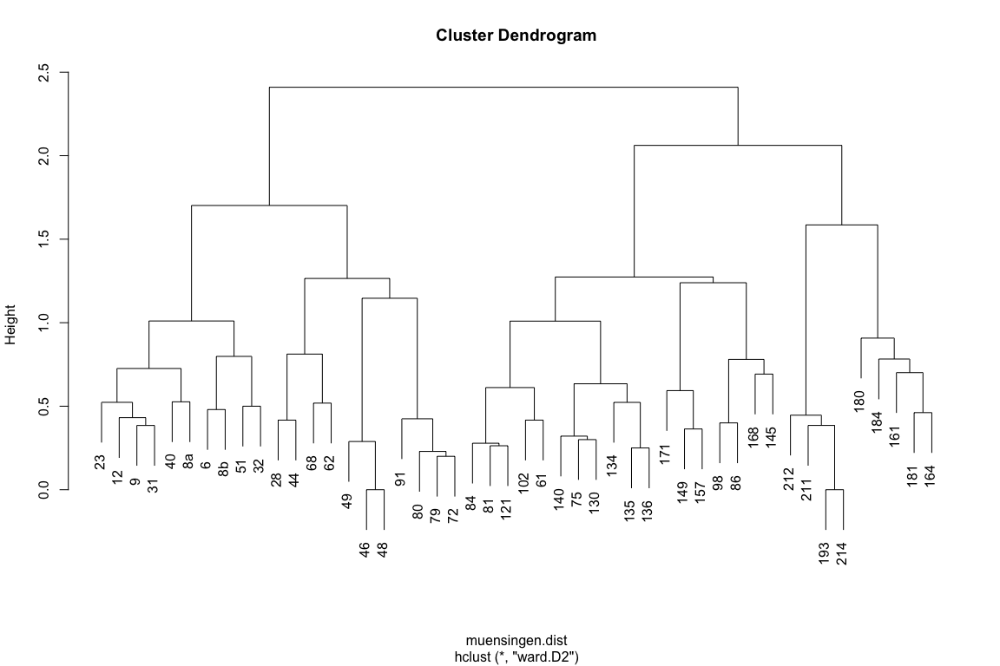
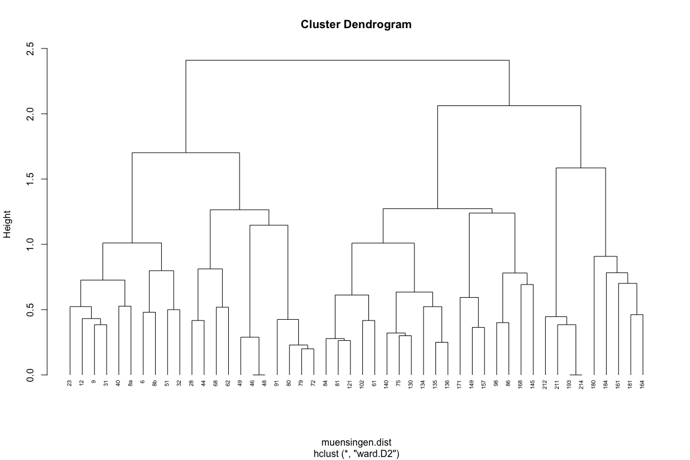
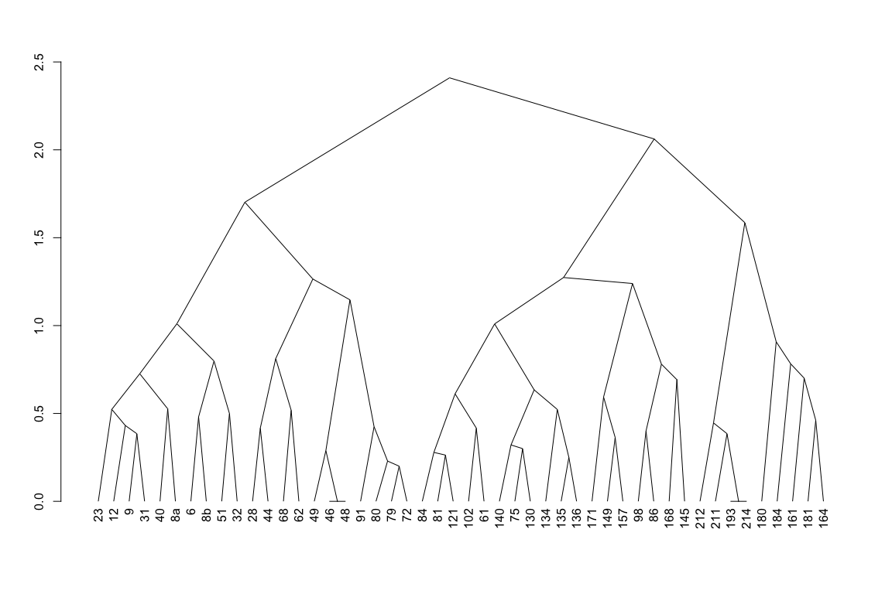
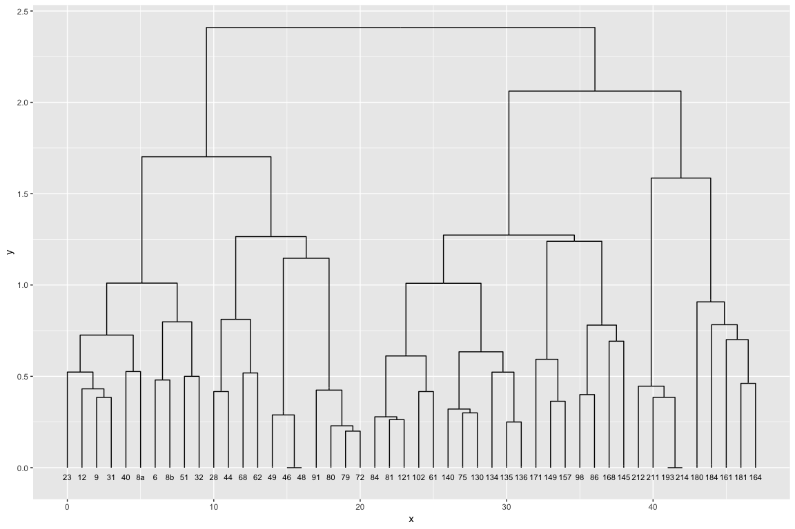
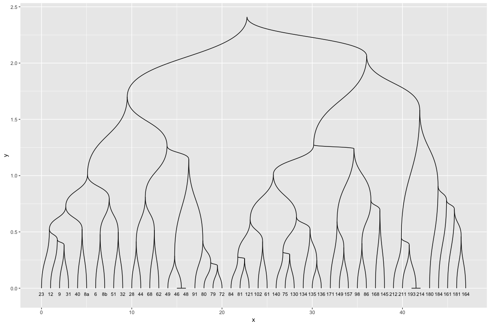
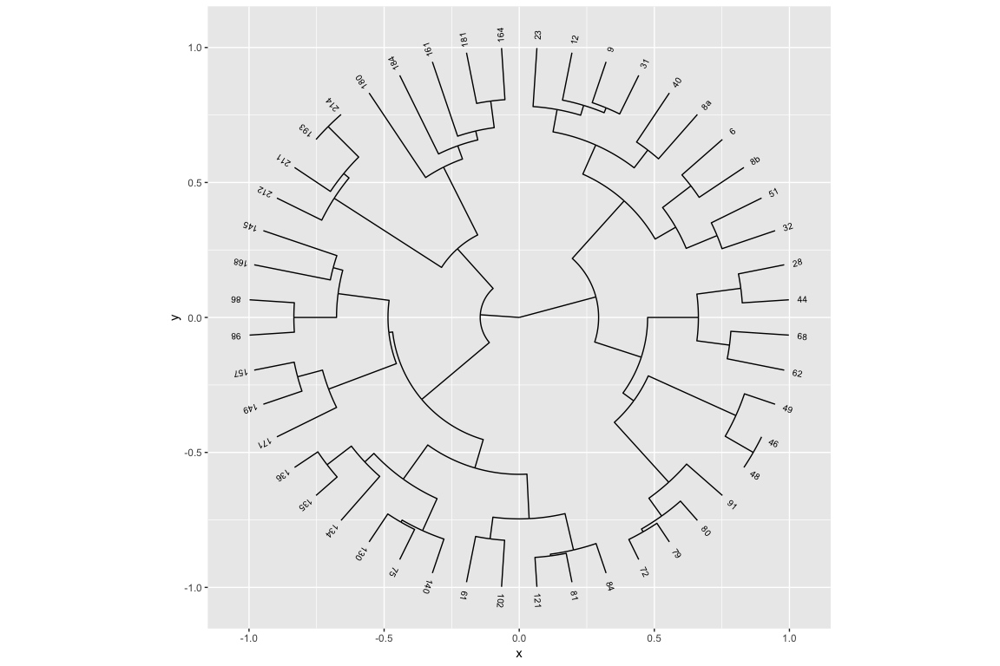

  


## Data Preparation


```r
muensingen <- read.csv("../seriation/muensingen_typochrono_bern_2018.csv", row.names = 1)
muensingen_data <- muensingen[1:35]
muensingen_phases <- muensingen[36]
```


## Cluster Analysis

### Hierarchical Clustering, Ward, Jaccard distance


```r
library(vegan)
```

```
## Warning: package 'vegan' was built under R version 3.5.2
```

```
## Loading required package: permute
```

```
## Loading required package: lattice
```

```
## This is vegan 2.5-4
```

```r
muensingen.dist <- vegdist(muensingen, method = "jacc")
muensingen.hclust <- hclust(muensingen.dist, method = "ward.D2")

plot(muensingen.hclust)
```

<!-- -->

```r
# Put the labels at the same height: hang = -1
plot(muensingen.hclust, hang = -1, cex = 0.6)
```

<!-- -->

```r
# As Triangle Dendrogram
muensingen.dg <- as.dendrogram(muensingen.hclust)
plot(muensingen.dg, type="triangle")
```

<!-- -->

```r
# ggplot (ggraph)
library(ggraph)
```

```
## Loading required package: ggplot2
```

```
## Warning: package 'ggplot2' was built under R version 3.5.2
```

```r
ggraph(muensingen.dg, 'dendrogram') + 
    geom_edge_elbow() + 
geom_node_text(aes(x = x, y=-0.05, filter=leaf, 
                 angle = node_angle(x, y), label = label), 
             size=3)
```

<!-- -->

```r
# rounded
ggraph(muensingen.dg, 'dendrogram') + 
    geom_edge_diagonal() + 
geom_node_text(aes(x = x, y=-0.05, filter=leaf, 
                 angle = node_angle(x, y), label = label), 
             size=3)
```

<!-- -->

```r
# circular
ggraph(muensingen.dg, 'dendrogram', circular = TRUE) + 
    geom_edge_elbow() + 
    coord_fixed() +
  geom_node_text(aes(x = x*1.05, y=y*1.05, filter = leaf, label=label, angle = node_angle(x, y)), size=2.7, alpha=1)
```

<!-- -->
