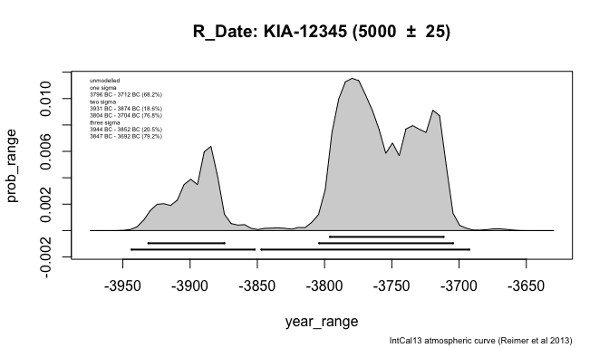
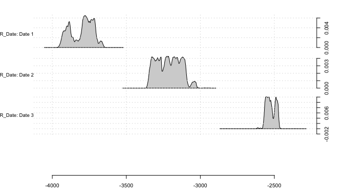
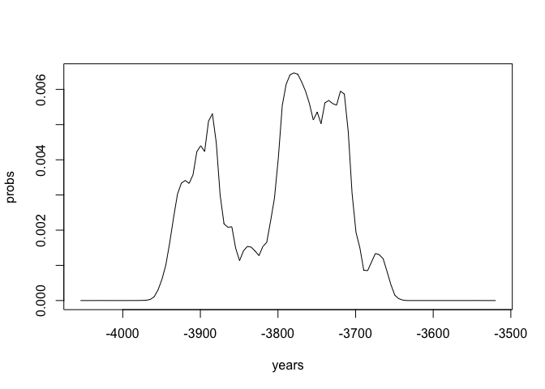
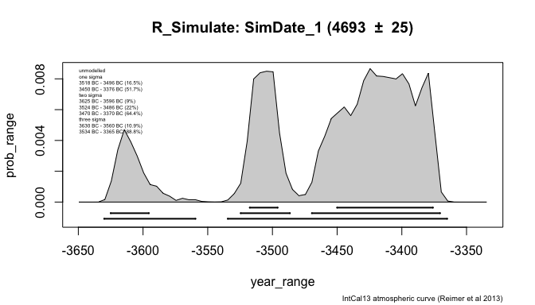
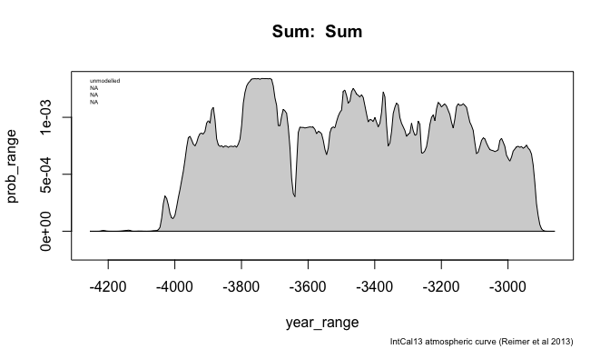

Basic Usage
================
Martin Hinz
2019-04-18

The package `oxcAAR` is designed to represent an interface between R and [Oxcal](https://c14.arch.ox.ac.uk). It offers the possibility to parse Oxcal scripts from data within R, execute them and reread the results from the Oxcal output files. There are other packages that can also calibrate <sup>14</sup>C data, like eg. `Bchron`, which will be sufficient and probably also faster than using `oxcAAR`. But this package is intended to use especially the algorithms of Oxcal, which is a quasi-standard for archaeological research these days.

``` r
if(!require('devtools')) install.packages('devtools')
```

    ## Loading required package: devtools

``` r
library(devtools)
install_github('ISAAKiel/oxcAAR')
```

    ## Skipping install of 'oxcAAR' from a github remote, the SHA1 (e84a52f2) has not changed since last install.
    ##   Use `force = TRUE` to force installation

Calibration (R\_Date)
---------------------

Lets assume we want to calibrate the date 5000 BP +- 25 years. `oxcAAR` has the function `oxcalCalibrate` for doing so. But at first we have to load the package and tell it where to find the local path to the [Oxcal distribution](https://c14.arch.ox.ac.uk/OxCalDistribution.zip). Afterwards you can calibrate the date using bp, std and name.

``` r
library(oxcAAR)
quickSetupOxcal()
```

    ## Oxcal doesn't seem to be installed. Downloading it now:

    ## Oxcal download to /private/var/folders/hj/3hdpf4yj50s9ls16sv8g6kdm0000gn/T/Rtmp74JEjI successful!

    ## Oxcal path set!

    ## NULL

``` r
#setOxcalExecutablePath("~/OxCal/bin/OxCalLinux")
my_date <- oxcalCalibrate(5000,25,"KIA-12345")
my_date
```

    ## 
    ## =============================
    ##  R_Date: KIA-12345
    ## =============================
    ## 
    ## 
    ## BP = 5000, std = 25
    ## 
    ## 
    ## unmodelled:                    posterior:
    ## 
    ## one sigma                      
    ## 3796 BC - 3712 BC (68.2%)      
    ## 
    ## two sigma                      
    ## 3931 BC - 3874 BC (18.6%)      
    ## 3804 BC - 3704 BC (76.8%)      
    ## 
    ## three sigma                    
    ## 3944 BC - 3852 BC (20.5%)      
    ## 3847 BC - 3692 BC (79.2%)      
    ## 
    ## Calibrated with:
    ##    IntCal13 atmospheric curve (Reimer et al 2013)

``` r
plot(my_date)
```



You can also calibrate multiple dates at once:

``` r
my_uncal_dates <- data.frame(bp=c(5000,4500,4000),
                             std=c(45,35,25),
                             names=c("Date 1", "Date 2", "Date 3")
                             )
my_cal_dates <- oxcalCalibrate(my_uncal_dates$bp, my_uncal_dates$std, my_uncal_dates$names)
my_cal_dates
```

    ## List of 3 calibrated dates:
    ## 
    ## =============================
    ##  R_Date: Date 1
    ## =============================
    ## 
    ## 
    ## BP = 5000, std = 45
    ## 
    ## 
    ## unmodelled:                    posterior:
    ## 
    ## one sigma                      
    ## 3910 BC - 3876 BC (14.9%)      
    ## 3802 BC - 3706 BC (53.3%)      
    ## 
    ## two sigma                      
    ## 3942 BC - 3692 BC (94.3%)      
    ## 3676 BC - 3668 BC (1.1%)       
    ## 
    ## three sigma                    
    ## 3954 BC - 3652 BC (99.7%)      
    ## 
    ## Calibrated with:
    ##    IntCal13 atmospheric curve (Reimer et al 2013) 
    ## 
    ## =============================
    ##  R_Date: Date 2
    ## =============================
    ## 
    ## 
    ## BP = 4500, std = 35
    ## 
    ## 
    ## unmodelled:                    posterior:
    ## 
    ## one sigma                      
    ## 3334 BC - 3263 BC (26%)        
    ## 3239 BC - 3208 BC (12.6%)      
    ## 3191 BC - 3150 BC (16.6%)      
    ## 3136 BC - 3104 BC (13%)        
    ## 
    ## two sigma                      
    ## 3353 BC - 3089 BC (95.4%)      
    ## 
    ## three sigma                    
    ## 3363 BC - 3020 BC (99.7%)      
    ## 
    ## Calibrated with:
    ##    IntCal13 atmospheric curve (Reimer et al 2013) 
    ## 
    ## =============================
    ##  R_Date: Date 3
    ## =============================
    ## 
    ## 
    ## BP = 4000, std = 25
    ## 
    ## 
    ## unmodelled:                    posterior:
    ## 
    ## one sigma                      
    ## 2564 BC - 2522 BC (48.6%)      
    ## 2495 BC - 2478 BC (19.6%)      
    ## 
    ## two sigma                      
    ## 2572 BC - 2470 BC (95.4%)      
    ## 
    ## three sigma                    
    ## 2618 BC - 2460 BC (99.7%)      
    ## 
    ## Calibrated with:
    ##    IntCal13 atmospheric curve (Reimer et al 2013)

``` r
plot(my_cal_dates)
```



And you might like to plot them on the calibration curve:

``` r
calcurve_plot(my_cal_dates)
```


The resulting object from the calibration is a list of class `oxcAARCalibratedDatesList`, containing elements of class `oxcAARCalibratedDate`. Each of these dates is again a list of the essential informations of the calibrated date including the raw probabilities, which can be extracted for additional analysis:

``` r
str(my_cal_dates, max.level = 1)
```

    ## List of 3
    ##  $ Date 1:List of 9
    ##   ..- attr(*, "class")= chr "oxcAARCalibratedDate"
    ##  $ Date 2:List of 9
    ##   ..- attr(*, "class")= chr "oxcAARCalibratedDate"
    ##  $ Date 3:List of 9
    ##   ..- attr(*, "class")= chr "oxcAARCalibratedDate"
    ##  - attr(*, "class")= chr [1:2] "list" "oxcAARCalibratedDatesList"

``` r
my_cal_dates[[1]] # equivalent to my_cal_dates[["Date 1"]] or my_cal_dates$`Date 1`
```

    ## 
    ## =============================
    ##  R_Date: Date 1
    ## =============================
    ## 
    ## 
    ## BP = 5000, std = 45
    ## 
    ## 
    ## unmodelled:                    posterior:
    ## 
    ## one sigma                      
    ## 3910 BC - 3876 BC (14.9%)      
    ## 3802 BC - 3706 BC (53.3%)      
    ## 
    ## two sigma                      
    ## 3942 BC - 3692 BC (94.3%)      
    ## 3676 BC - 3668 BC (1.1%)       
    ## 
    ## three sigma                    
    ## 3954 BC - 3652 BC (99.7%)      
    ## 
    ## Calibrated with:
    ##    IntCal13 atmospheric curve (Reimer et al 2013)

``` r
str(my_cal_dates$`Date 1`)
```

    ## List of 9
    ##  $ name                   : chr "Date 1"
    ##  $ type                   : chr "R_Date"
    ##  $ bp                     : int 5000
    ##  $ std                    : int 45
    ##  $ cal_curve              :List of 5
    ##   ..$ name      : chr " IntCal13 atmospheric curve (Reimer et al 2013)"
    ##   ..$ resolution: num 5
    ##   ..$ bp        : num [1:10001] 46401 46396 46391 46386 46381 ...
    ##   ..$ bc        : num [1:10001] -48050 -48044 -48040 -48034 -48030 ...
    ##   ..$ sigma     : num [1:10001] 274 274 274 273 273 ...
    ##  $ sigma_ranges           :List of 3
    ##   ..$ one_sigma  :'data.frame':  2 obs. of  3 variables:
    ##   .. ..$ start      : num [1:2] -3910 -3802
    ##   .. ..$ end        : num [1:2] -3876 -3706
    ##   .. ..$ probability: num [1:2] 14.9 53.3
    ##   ..$ two_sigma  :'data.frame':  2 obs. of  3 variables:
    ##   .. ..$ start      : num [1:2] -3942 -3676
    ##   .. ..$ end        : num [1:2] -3692 -3668
    ##   .. ..$ probability: num [1:2] 94.3 1.1
    ##   ..$ three_sigma:'data.frame':  1 obs. of  3 variables:
    ##   .. ..$ start      : num -3954
    ##   .. ..$ end        : num -3652
    ##   .. ..$ probability: num 99.7
    ##  $ raw_probabilities      :'data.frame': 108 obs. of  2 variables:
    ##   ..$ dates        : num [1:108] -4054 -4050 -4044 -4040 -4034 ...
    ##   ..$ probabilities: num [1:108] 0.00 0.00 0.00 1.94e-08 1.49e-07 ...
    ##  $ posterior_sigma_ranges :List of 3
    ##   ..$ one_sigma  : logi NA
    ##   ..$ two_sigma  : logi NA
    ##   ..$ three_sigma: logi NA
    ##  $ posterior_probabilities: logi NA
    ##  - attr(*, "class")= chr "oxcAARCalibratedDate"

``` r
plot(
  my_cal_dates$`Date 1`$raw_probabilities$dates,
  my_cal_dates$`Date 1`$raw_probabilities$probabilities,
  type = "l",
  xlab = "years",
  ylab = "probs"
  )
```



Simulation (R\_Simulate)
------------------------

You can also use `oxcAAR` to simulate <sup>14</sup>C dates the same way as the OxCal R\_Simulate function works. You enter a calibrated year (1000 for 1000 AD, -1000 for 1000 BC) and OxCal will simulate a BP value using a bit of randomisation. Resulting in the fact that each run will have a slightly different BP value.

``` r
my_cal_date <- data.frame(bp=c(-3400),
                             std=c(25),
                             names=c("SimDate_1")
                             )
my_simulated_dates <- oxcalSimulate(my_cal_date$bp,
                                    my_cal_date$std,
                                    my_cal_date$names
                                    )
# equivalent to
my_simulated_dates <- oxcalSimulate(-3400, 25, "SimDate_1")
my_simulated_dates
```

    ## 
    ## =============================
    ##  R_Simulate: SimDate_1
    ## =============================
    ## 
    ## 
    ## BP = 4728, std = 25
    ## 
    ## 
    ## unmodelled:                    posterior:
    ## 
    ## one sigma                      
    ## 3626 BC - 3584 BC (34%)        
    ## 3529 BC - 3512 BC (12%)        
    ## 3421 BC - 3382 BC (22.2%)      
    ## 
    ## two sigma                      
    ## 3632 BC - 3554 BC (44.6%)      
    ## 3538 BC - 3496 BC (20.7%)      
    ## 3434 BC - 3376 BC (30.1%)      
    ## 
    ## three sigma                    
    ## 3634 BC - 3492 BC (67%)        
    ## 3464 BC - 3372 BC (32.7%)      
    ## 
    ## Calibrated with:
    ##    IntCal13 atmospheric curve (Reimer et al 2013)

``` r
plot(my_simulated_dates)
```



Simulate Sum Calibration
------------------------

This package was originally intended to support a series of articles dealing with the investigation of sum calibration. This is why a function is implemented to simulate sum calibration. You can use it to simulate a series of <sup>14</sup>C dates and explore the sum calibrated results. You can specify the beginning and end of the time span that should be used for the simulation (in calender years), the number of <sup>14</sup>C dates that should be simulated, their standard deviation, either as vector of length n or as one number for all dates, and the type of distribution that should be used (either equally spaced in time, or random uniform). The result is again of class `oxcAARCalibratedDate` so you can access the raw probabilities for further analysis.

``` r
my_sum_sim<-oxcalSumSim(
  timeframe_begin = -4000,
  timeframe_end = -3000,
  n = 50,
  stds = 35,
  date_distribution = "uniform"
  )
str(my_sum_sim)
```

    ## List of 9
    ##  $ name                   : chr " Sum "
    ##  $ type                   : chr "Sum"
    ##  $ bp                     : logi NA
    ##  $ std                    : logi NA
    ##  $ cal_curve              :List of 5
    ##   ..$ name      : chr " IntCal13 atmospheric curve (Reimer et al 2013)"
    ##   ..$ resolution: num 5
    ##   ..$ bp        : num [1:10001] 46401 46396 46391 46386 46381 ...
    ##   ..$ bc        : num [1:10001] -48050 -48044 -48040 -48034 -48030 ...
    ##   ..$ sigma     : num [1:10001] 274 274 274 273 273 ...
    ##  $ sigma_ranges           :List of 3
    ##   ..$ one_sigma  : logi NA
    ##   ..$ two_sigma  : logi NA
    ##   ..$ three_sigma: logi NA
    ##  $ raw_probabilities      :'data.frame': 332 obs. of  2 variables:
    ##   ..$ dates        : num [1:332] -4354 -4350 -4344 -4340 -4334 ...
    ##   ..$ probabilities: num [1:332] 0.00 0.00 0.00 0.00 4.15e-09 ...
    ##  $ posterior_sigma_ranges :List of 3
    ##   ..$ one_sigma  : logi NA
    ##   ..$ two_sigma  : logi NA
    ##   ..$ three_sigma: logi NA
    ##  $ posterior_probabilities: logi NA
    ##  - attr(*, "class")= chr "oxcAARCalibratedDate"

``` r
plot(my_sum_sim)
```



Execute custom OxCal code
-------------------------

You can also use the package to execute your own OxCal code from within R, and import the results back into the workspace. You can use `R_Date`, `R_Simulate` and `oxcal_Sum` to produce that OxCal code:

    ## Warning: package 'knitr' was built under R version 3.5.2

``` r
R_Simulate(-4000, 25, "MySimDate")
```

    ## [1] "R_Simulate(\"MySimDate\",\n          -4000, 25);"

``` r
my_dates <- R_Date(c("Lab-12345","Lab-54321"), c(5000,4500), 25)
cat(my_dates)
```

    ## R_Date("Lab-12345", 5000, 25);
    ## R_Date("Lab-54321", 4500, 25);

``` r
my_sum <- oxcal_Sum(my_dates)
cat(my_sum)
```

    ## Sum(" Sum "){
    ##  R_Date("Lab-12345", 5000, 25);
    ## R_Date("Lab-54321", 4500, 25); 
    ## };

or use your own script as string variable.

``` r
knitr::opts_chunk$set(cache=TRUE)
my_oxcal_code <- ' Plot()
 {
  Sequence("Sequence1")
  {
   Boundary("Beginn");
   Phase("Phase1")
   {
    R_Date("Lab-1",5000,25);
    R_Date("Lab-2",4900,37);
   };
   Boundary("Between");
   Phase("Phase2")
   {
    R_Date("Lab-3",4800,43);
   };
   Boundary("End");
  };
 };'
my_result_file <- executeOxcalScript(my_oxcal_code)
my_result_text <- readOxcalOutput(my_result_file)
```

You can either parse the result to a 'standard' oxcAAR object:

``` r
my_result_data <- parseOxcalOutput(my_result_text)
str(my_result_data)
```

    ## List of 3
    ##  $ Lab-1:List of 9
    ##   ..$ name                   : chr "Lab-1"
    ##   ..$ type                   : chr "R_Date"
    ##   ..$ bp                     : int 5000
    ##   ..$ std                    : int 25
    ##   ..$ cal_curve              :List of 5
    ##   .. ..$ name      : chr " IntCal13 atmospheric curve (Reimer et al 2013)"
    ...

``` r
print(my_result_data)
```

    ## List of 3 calibrated dates:
    ## 
    ## =============================
    ##  R_Date: Lab-1
    ## =============================
    ## 
    ## 
    ## BP = 5000, std = 25
    ...

Or you get the whole output of Oxcal as object:

``` r
my_result_data <- parseFullOxcalOutput(my_result_text)
str(my_result_data)
```

    ## List of 12
    ##  $ ocd[0]  :List of 4
    ##   ..$ likelihood:List of 5
    ##   .. ..$ comment   :List of 1
    ##   .. .. ..$ : list()
    ##   .. ..$ comment[0]: chr "OxCal v4.3.2 Bronk Ramsey (2017); r:5"
    ##   .. ..$ comment[1]: chr " IntCal13 atmospheric curve (Reimer et al 2013)"
    ##   .. ..$ comment[2]: chr "( Phase Phase1"
    ...
