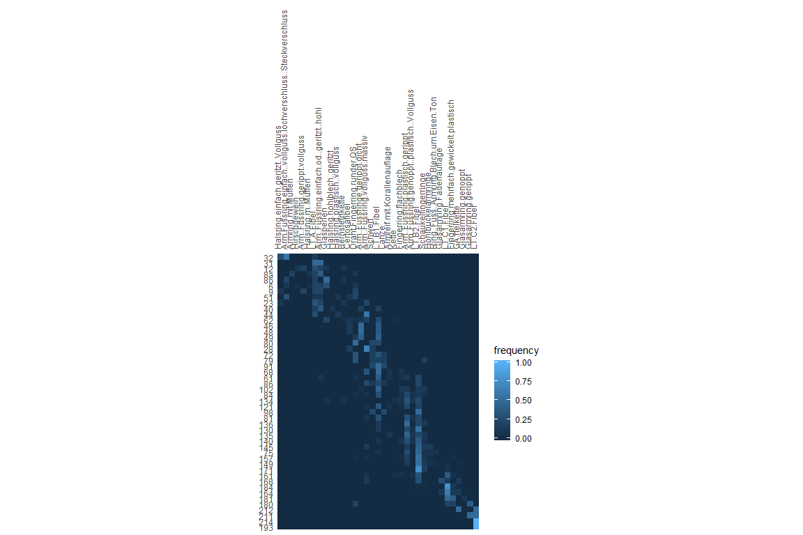
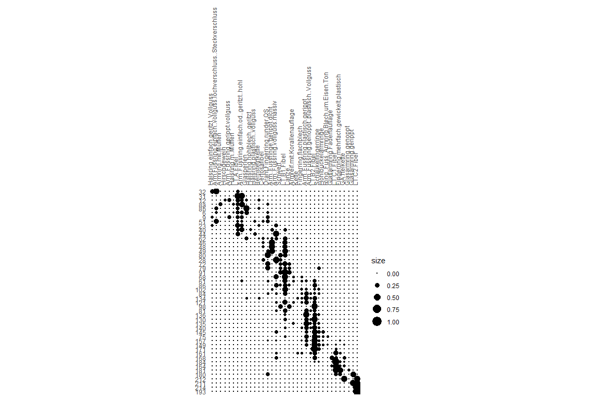
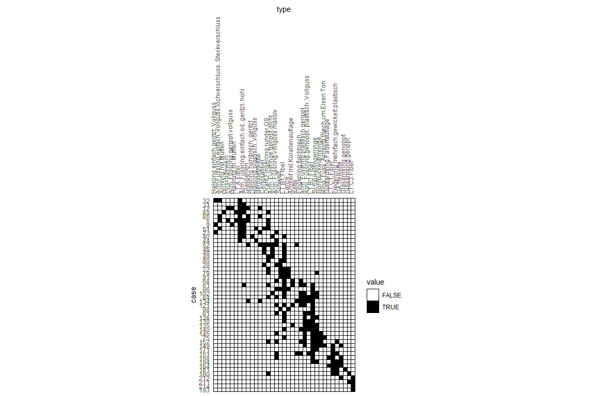
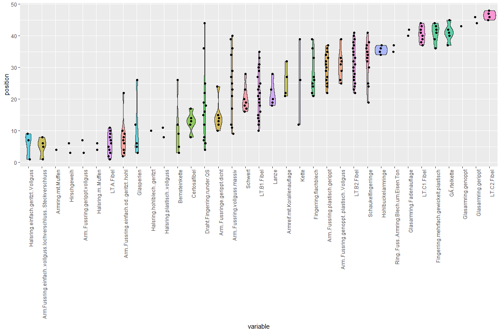

## Data Preparation


```r
muensingen <- read.csv("muensingen_typochrono_bern_2018.csv", row.names = 1)
muensingen_data <- muensingen[1:35]
muensingen_phases <- muensingen[36]
```


## Ordination/Seriation

### by CA


```r
library(vegan)
```

```
## Loading required package: permute
```

```
## Loading required package: lattice
```

```
## This is vegan 2.5-4
```

```r
ca_result <- cca(as.matrix(muensingen_data))
order_sites <- order(scores(ca_result,1,"sites"))
order_species <- order(scores(ca_result, 1, "species"))
ca_ordered_matrix <- as.matrix(muensingen_data[order_sites,order_species])
```

### by Reciprocal Averaging


```r
untidy <- TRUE
max_it <- 1000
counter <- 0
rva <- as.matrix(muensingen_data)
while(untidy & counter < max_it)
{
  counter <- counter + 1
  rva_old <- rva
  row_ind_mean <- rowSums(t(t(rva) * 1:ncol(rva)))/rowSums(rva)
  col_ind_mean <- colSums(rva * 1:nrow(rva))/colSums(rva)
  rva <- rva[order(row_ind_mean),order(col_ind_mean)]
  if(all(rva==rva_old)) tidy=TRUE
}
ra_ordered_matrix <- rva
```
## Visualisation

### CA Results

#### Seriation Plot, Counts


```r
library(tabula)
```

```
## 
## Attaching package: 'tabula'
```

```
## The following object is masked from 'package:vegan':
## 
##     diversity
```

```
## The following object is masked from 'package:permute':
## 
##     permute
```

```r
incidence_ca <- CountMatrix(data = ca_ordered_matrix, nrow = nrow(ca_ordered_matrix),
                            dimnames = dimnames(ca_ordered_matrix))

plotMatrix(incidence_ca)
```

<!-- -->

#### Seriation Plot, Dots


```r
plotSpot(incidence_ca)
```

<!-- -->


#### Seriation Plot, Incidents


```r
plotMatrix(as(incidence_ca, "IncidenceMatrix"))+
  ggplot2::scale_fill_manual(values = c("TRUE" = "black", "FALSE" = "white"))
```

<!-- -->

#### Battleship Bar Plot


```r
plotBar(incidence_ca)
```

<!-- -->


#### Battleship Violin Plot


```r
library(reshape2)
library(ggplot2)
frequency_ca <- as(incidence_ca, "FrequencyMatrix")

frequency_ca_melted <- melt(
  data.frame(incidence_ca,
             position=1:nrow(frequency_ca)),
  id.vars = "position")

frequency_ca_melted <- frequency_ca_melted[frequency_ca_melted$value!=0,]

ggplot(frequency_ca_melted, aes(x=variable, y=position, fill=variable)) +
  geom_violin(alpha=0.6) +
  geom_jitter(height = 0, width = 0.1) +
  theme(legend.position="none", axis.text.x = element_text(angle = 90, hjust = 1))
```

<!-- -->

