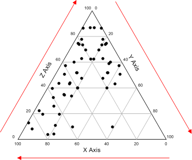

```{r setup, include=FALSE}
knitr::opts_chunk$set(echo = TRUE)
```

## R Ternary Plots

All data and some Text are from Baxter & Cool 2016 <http://www.barbicanra.co.uk/simple-r.html>.
Please cite as:


\begin{equation}
\label{eq-abc}
a + b = c
\end{equation}
[\code]

Ternary diagrams go under a variety of names – triangular, tripolar or phase diagrams among them. They are used when p = 3 variables are available that are scaled to sum to 100% (or 1). The data may be categorical or continuous. This scaling (or compositional constraint) means the values of any two variables determine the value of the third variable. This implies that the data are exactly two-dimensional.The data can be plotted in an equilateral triangle where a point represents the relative proportions of the three variables as measured by the (perpendicular) distances to the three axes. In effect, and as previously noted, a point in a ternary diagram encapsulates the same information as a pie chart for three categories, with the considerable advantage that the distances between points are visualized. Howarth’s (1996) history of the ternary diagram traces its origins to the mid-18th century. Their use in archaeology is widespread, often occurring in the more ‘specialised’ literature. Howarth (1996: 338) notes that they are widely used ingeology, physical chemistry and metallurgy and are to be found in archaeological publications that interact with these disciplines. Recent papers in this vein that use ternary diagrams include Hughes et al. (2010) study of flint compositions, Panich (2016) of obsidian, and Chirikure et al. (2010) of slags. For data sets with more than 3 variables composite variables (i.e. linear combinations of those available) are sometimes defined to enable their representation in a ternary diagram (e.g., Hein et al. 2007: 149; Plaza and Martinón-Torres 2015: 93). Another use is in phase diagrams where a plot is ‘zoned’ in some way to identify, for example, different classes of material or manufacturing technologies corresponding to different regions of the diagram. Data are then plotted to characterize the cases beings studied (e.g., Thornton and Rehren 2009; Radivojevic et al. 2010).



For an initial illustration, data from folder data_kasar_akil in Doran and Hodson (1975) are used. The left-hand table shows the counts of cores, blanks and stone tools found in different levels at the palaeolithic site of Ksar Akil (Lebanon); the levels are numbered from earliest (25) to latest (12). The right-hand table shows the counts converted to percentage for each level and can be represented in a ternary diagram 1b. Read the data (i.e. the headers and what follows) into a data frame Ksar – you will need to select a subset of the columns for analysis. Either Ksar[, 1:4] or Ksar[, c(1,5:7] will do it. we’ll use the former; ggtern will transform these to the percentages needed. The ternary diagram for these data, in Figure 1a, is followed by the code used.

```{r}
#load libraries
library(ggplot2);library(grid); library(ggtern)
```

```{r}
#show data
Ksar <- read.csv("data_ksar_akil/ksar_akil.csv")
print(Ksar)
```


###Ternery diagram 1a

```{r}
#ternary diagram  with dots fig. 1a
ggtern(data=Ksar[,1:4],aes(Cores, Blanks, Tools, label=Levels)) +
  geom_point(size = 3) + theme_showarrows()
```
fig. 1a: Ternery diagram 1a


###Ternary diagram 1b

```{r}
#ternary diagram with numbers fig. 1b
Ksar <- read.csv("data_ksar_akil/ksar_akil.csv")
library(ggplot2);library(grid); library(ggtern)
ggtern(data=Ksar[,1:4],aes(Cores, Blanks, Tools, label=Levels)) +
geom_text() + theme_showarrows()
```

Change the dataset --> data_faunal/king

```{r}
king <- read.csv("data_faunal/king.csv")
```


```{r}
king <- read.csv("data_faunal/king.csv")
ggtern(data=king,aes(C, P, SG, colour=Type, shape=Type, fill = Type)) +
geom_point() + theme_showarrows()
```

The upper plot is the ‘default’ ternary diagram for Romano-British civilian
faunal assemblages using ggtern; the lower plot is a ‘modified’ version. C = Cattle, P
= Pig, SG = Sheep/Goat.

```{r}
fig2 <- function() {
library(ggplot2); library(grid); library(grid); library(ggtern)
king$Type <- factor(king$Type, labels = c("Rural settlement", "Urban site", "Vicus", "Villa"))
p <- ggtern(data=king,aes(C, P, SG, colour=Type, shape=Type, fill=Type)) +
geom_point(size = 3) + theme_showarrows() +
scale_shape_manual(values=c(21,22,24,25)) +
scale_colour_manual(values=rep("black", 4)) +
scale_fill_manual(values=c("skyblue", "red", "yellow", "white")) +
theme_legend_position("tl") +
theme(legend.title=element_text(size=16),
legend.key.height=unit(1, "cm"), legend.key.width=unit(1, "cm"))
p
}
fig2 ()
```

##References