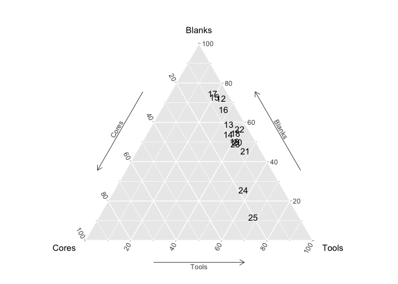

## R Markdown

This is an R Markdown document. Markdown is a simple formatting syntax for authoring HTML, PDF, and MS Word documents. For more details on using R Markdown see <http://rmarkdown.rstudio.com>.

When you click the **Knit** button a document will be generated that includes both content as well as the output of any embedded R code chunks within the document. You can embed an R code chunk like this:

These are the r-codes

```r
#load libraries
library(ggplot2);library(grid); library(ggtern)
```

```
## Warning: package 'ggplot2' was built under R version 3.5.2
```

```
## --
## Remember to cite, run citation(package = 'ggtern') for further info.
## --
```

```
## 
## Attaching package: 'ggtern'
```

```
## The following objects are masked from 'package:ggplot2':
## 
##     %+%, aes, annotate, calc_element, ggplot, ggplotGrob,
##     ggplot_build, ggplot_gtable, ggsave, layer_data, theme,
##     theme_bw, theme_classic, theme_dark, theme_gray, theme_light,
##     theme_linedraw, theme_minimal, theme_void
```


These are the r-codes

```r
#ternary diagram with dots
Ksar <- read.csv("data_ksar_akil/ksar_akil.csv")
ggtern(data=Ksar[,1:4],aes(Cores, Blanks, Tools, label=Levels)) +
  geom_point(size = 3) + theme_showarrows()
```

<!-- -->

This is der secound plot with numbers

```r
#ternary diagram with numbers
Ksar <- read.csv("data_ksar_akil/ksar_akil.csv")
library(ggplot2);library(grid); library(ggtern)
ggtern(data=Ksar[,1:4],aes(Cores, Blanks, Tools, label=Levels)) +
geom_text() + theme_showarrows()
```

<!-- -->

Lets change the dataset --> data_faunal --> King.csv

