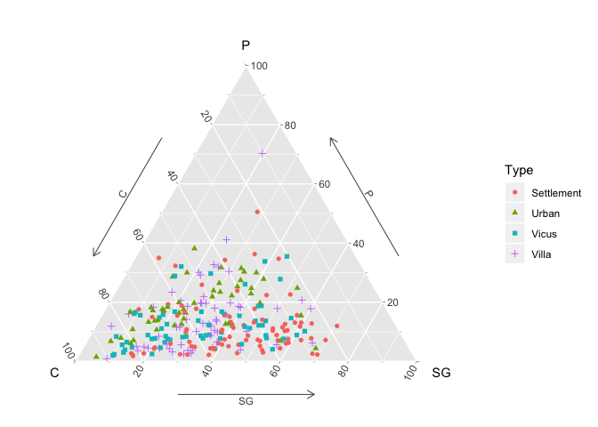
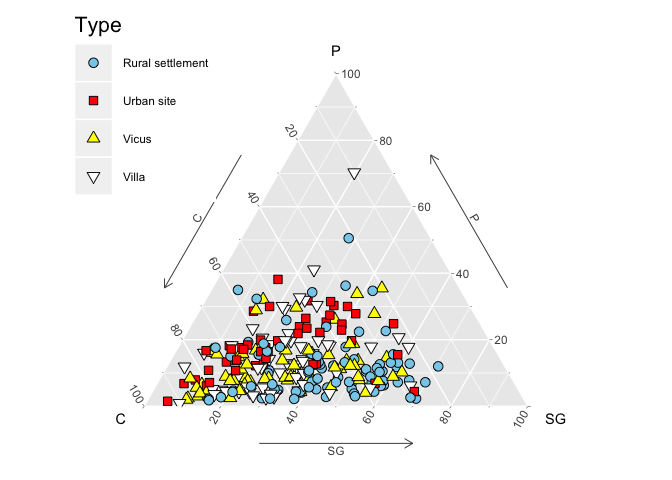

## R Ternary Plots


All data in this file are from Baxter & Cool 2016 <http://www.barbicanra.co.uk/simple-r.html>.


For an initial illustration, data from folder data_kasar_akil in Doran and Hodson (1975) are used. The left-hand table shows the counts of cores, blanks and stone tools found in different levels at the palaeolithic site of Ksar Akil (Lebanon); the levels are numbered from earliest (25) to latest (12). The right-hand table shows the counts converted to percentage for each level and can be represented in a ternary diagram 1b. Read the data (i.e. the headers and what follows) into a data frame Ksar – you will need to select a subset of the columns for analysis. Either Ksar[, 1:4] or Ksar[, c(1,5:7] will do it. we’ll use the former; ggtern will transform these to the percentages needed. The ternary diagram for these data, in Figure 1a, is followed by the code used.


```r
#load libraries
library(ggplot2);library(grid); library(ggtern)
```

```
## Warning: package 'ggplot2' was built under R version 3.5.2
```

```
## --
## Remember to cite, run citation(package = 'ggtern') for further info.
## --
```

```
## 
## Attaching package: 'ggtern'
```

```
## The following objects are masked from 'package:ggplot2':
## 
##     %+%, aes, annotate, calc_element, ggplot, ggplotGrob,
##     ggplot_build, ggplot_gtable, ggsave, layer_data, theme,
##     theme_bw, theme_classic, theme_dark, theme_gray, theme_light,
##     theme_linedraw, theme_minimal, theme_void
```

Ternery diagram 1a


```r
#ternary diagram  with dots fig. 1a
Ksar <- read.csv("data_ksar_akil/ksar_akil.csv")
ggtern(data=Ksar[,1:4],aes(Cores, Blanks, Tools, label=Levels)) +
  geom_point(size = 3) + theme_showarrows()
```

<!-- -->

Ternary diagram 1b


```r
#ternary diagram with numbers fig. 1b
Ksar <- read.csv("data_ksar_akil/ksar_akil.csv")
library(ggplot2);library(grid); library(ggtern)
ggtern(data=Ksar[,1:4],aes(Cores, Blanks, Tools, label=Levels)) +
geom_text() + theme_showarrows()
```

<!-- -->

Change the dataset --> data_faunal/king


```r
king <- read.csv("data_faunal/king.csv")
library(ggplot2); library(grid); library(ggtern)
ggtern(data=king,aes(C, P, SG, colour=Type, shape=Type, fill = Type)) +
geom_point() + theme_showarrows()
```

<!-- -->

The upper plot is the ‘default’ ternary diagram for Romano-British civilian
faunal assemblages using ggtern; the lower plot is a ‘modified’ version. C = Cattle, P
= Pig, SG = Sheep/Goat.


```r
fig2 <- function() {
library(ggplot2); library(grid); library(grid); library(ggtern)
king$Type <- factor(king$Type, labels = c("Rural settlement", "Urban site", "Vicus", "Villa"))
p <- ggtern(data=king,aes(C, P, SG, colour=Type, shape=Type, fill=Type)) +
geom_point(size = 3) + theme_showarrows() +
scale_shape_manual(values=c(21,22,24,25)) +
scale_colour_manual(values=rep("black", 4)) +
scale_fill_manual(values=c("skyblue", "red", "yellow", "white")) +
theme_legend_position("tl") +
theme(legend.title=element_text(size=16),
legend.key.height=unit(1, "cm"), legend.key.width=unit(1, "cm"))
p
}
fig2 ()
```

<!-- -->


