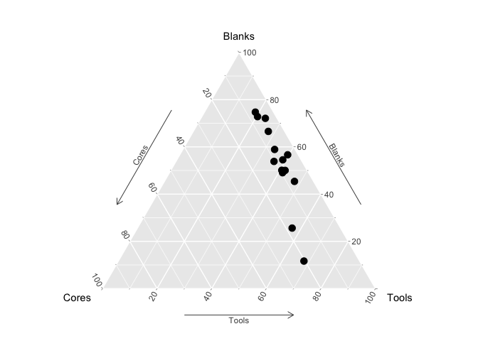

<!--html_preserve--><img src="data:image/jpeg;base64,/9j/4QSfRXhpZgAATU0AKgAAAAgABwESAAMAAAABAAEAAAEaAAUAAAABAAAAYgEbAAUAAAABAAAAagEoAAMAAAABAAIAAAExAAIAAAAkAAAAcgEyAAIAAAAUAAAAlodpAAQAAAABAAAArAAAANgALcbAAAAnEAAtxsAAACcQQWRvYmUgUGhvdG9zaG9wIENDIDIwMTUgKE1hY2ludG9zaCkAMjAxNjowMjoxNSAwODowMjoxMgAAAAADoAEAAwAAAAEAAQAAoAIABAAAAAEAAABkoAMABAAAAAEAAABMAAAAAAAAAAYBAwADAAAAAQAGAAABGgAFAAAAAQAAASYBGwAFAAAAAQAAAS4BKAADAAAAAQACAAACAQAEAAAAAQAAATYCAgAEAAAAAQAAA2EAAAAAAAAASAAAAAEAAABIAAAAAf/Y/+0ADEFkb2JlX0NNAAH/7gAOQWRvYmUAZIAAAAAB/9sAhAAMCAgICQgMCQkMEQsKCxEVDwwMDxUYExMVExMYEQwMDAwMDBEMDAwMDAwMDAwMDAwMDAwMDAwMDAwMDAwMDAwMAQ0LCw0ODRAODhAUDg4OFBQODg4OFBEMDAwMDBERDAwMDAwMEQwMDAwMDAwMDAwMDAwMDAwMDAwMDAwMDAwMDAz/wAARCAASABgDASIAAhEBAxEB/90ABAAC/8QBPwAAAQUBAQEBAQEAAAAAAAAAAwABAgQFBgcICQoLAQABBQEBAQEBAQAAAAAAAAABAAIDBAUGBwgJCgsQAAEEAQMCBAIFBwYIBQMMMwEAAhEDBCESMQVBUWETInGBMgYUkaGxQiMkFVLBYjM0coLRQwclklPw4fFjczUWorKDJkSTVGRFwqN0NhfSVeJl8rOEw9N14/NGJ5SkhbSVxNTk9KW1xdXl9VZmdoaWprbG1ub2N0dXZ3eHl6e3x9fn9xEAAgIBAgQEAwQFBgcHBgU1AQACEQMhMRIEQVFhcSITBTKBkRShsUIjwVLR8DMkYuFygpJDUxVjczTxJQYWorKDByY1wtJEk1SjF2RFVTZ0ZeLys4TD03Xj80aUpIW0lcTU5PSltcXV5fVWZnaGlqa2xtbm9ic3R1dnd4eXp7fH/9oADAMBAAIRAxEAPwDurMzMz8o4+K706xOoMe0aeo9493u/casbqPWOk9Nz7cDKOfdk0bd76G17Tua20envs9X6L1r24uf0vMdlYlX2nHfIdW36QaTu2bfpe13825m9cf1DJzL/AK6W39Oc/Dynkek6ysvcwjHax7X47WZDve0Pb/NP/wBIrHLY4TlPj2jAz34fl/eYc85QEeHeUhHa93e6R9a8e3JNVF176me6yjMaBaGAhtt1F1TrGv8As877qLPf6X82ksb6qVM6l13IPUbHjqrt/rttDWgsBbXksYxgb+sbW+hY39GynH/mvUf/ADCUvsY/vHt0a4eLf08f9/8Azf8AXY/dn7PHYvirx4f7n+c/qv8A/9D1VcIP/wAqH5vP9r+hrxBJWeV/y3+xmwcx/k/9pF9mzf8A8pVf/hir+jfzn8z/AIT/AN3P+6aS8ZSVr9H/ANNmD9L/AKs//9n/7Q0QUGhvdG9zaG9wIDMuMAA4QklNBCUAAAAAABAAAAAAAAAAAAAAAAAAAAAAOEJJTQQ6AAAAAAFnAAAAEAAAAAEAAAAAAAtwcmludE91dHB1dAAAAAcAAAAAQ2xyU2VudW0AAAAAQ2xyUwAAAABSR0JDAAAAAE5tICBURVhUAAAAEwBDAGEAbQBlAHIAYQAgAFIARwBCACAAUAByAG8AZgBpAGwAZQAAAAAAAEludGVlbnVtAAAAAEludGUAAAAAQ2xybQAAAABNcEJsYm9vbAEAAAAPcHJpbnRTaXh0ZWVuQml0Ym9vbAAAAAALcHJpbnRlck5hbWVURVhUAAAAGQBPAGYAZgBpAGMAZQBqAGUAdAAgAFAAcgBvACAAOAA1ADAAMAAgAEEAOQAwADkAZwAAAAAAD3ByaW50UHJvb2ZTZXR1cE9iamMAAAAMAFAAcgBvAG8AZgAgAFMAZQB0AHUAcAAAAAAACnByb29mU2V0dXAAAAABAAAAAEJsdG5lbnVtAAAADGJ1aWx0aW5Qcm9vZgAAAAlwcm9vZkNNWUsAOEJJTQQ7AAAAAAItAAAAEAAAAAEAAAAAABJwcmludE91dHB1dE9wdGlvbnMAAAAXAAAAAENwdG5ib29sAAAAAABDbGJyYm9vbAAAAAAAUmdzTWJvb2wAAAAAAENybkNib29sAAAAAABDbnRDYm9vbAAAAAAATGJsc2Jvb2wAAAAAAE5ndHZib29sAAAAAABFbWxEYm9vbAAAAAAASW50cmJvb2wAAAAAAEJja2dPYmpjAAAAAQAAAAAAAFJHQkMAAAADAAAAAFJkICBkb3ViQG/gAAAAAAAAAAAAR3JuIGRvdWJAb+AAAAAAAAAAAABCbCAgZG91YkBv4AAAAAAAAAAAAEJyZFRVbnRGI1JsdAAAAAAAAAAAAAAAAEJsZCBVbnRGI1JsdAAAAAAAAAAAAAAAAFJzbHRVbnRGI1B4bEBywAAAAAAAAAAACnZlY3RvckRhdGFib29sAQAAAABQZ1BzZW51bQAAAABQZ1BzAAAAAFBnUEMAAAAATGVmdFVudEYjUmx0AAAAAAAAAAAAAAAAVG9wIFVudEYjUmx0AAAAAAAAAAAAAAAAU2NsIFVudEYjUHJjQFkAAAAAAAAAAAAQY3JvcFdoZW5QcmludGluZ2Jvb2wAAAAADmNyb3BSZWN0Qm90dG9tbG9uZwAAAAAAAAAMY3JvcFJlY3RMZWZ0bG9uZwAAAAAAAAANY3JvcFJlY3RSaWdodGxvbmcAAAAAAAAAC2Nyb3BSZWN0VG9wbG9uZwAAAAAAOEJJTQPtAAAAAAAQASwAAAABAAIBLAAAAAEAAjhCSU0EJgAAAAAADgAAAAAAAAAAAAA/gAAAOEJJTQQNAAAAAAAEAAAAHjhCSU0EGQAAAAAABAAAAB44QklNA/MAAAAAAAkAAAAAAAAAAAEAOEJJTScQAAAAAAAKAAEAAAAAAAAAAjhCSU0D9QAAAAAASAAvZmYAAQBsZmYABgAAAAAAAQAvZmYAAQChmZoABgAAAAAAAQAyAAAAAQBaAAAABgAAAAAAAQA1AAAAAQAtAAAABgAAAAAAAThCSU0D+AAAAAAAcAAA/////////////////////////////wPoAAAAAP////////////////////////////8D6AAAAAD/////////////////////////////A+gAAAAA/////////////////////////////wPoAAA4QklNBAAAAAAAAAIAADhCSU0EAgAAAAAAAgAAOEJJTQQwAAAAAAABAQA4QklNBC0AAAAAAAYAAQAAAAI4QklNBAgAAAAAABAAAAABAAACQAAAAkAAAAAAOEJJTQQeAAAAAAAEAAAAADhCSU0EGgAAAAADPwAAAAYAAAAAAAAAAAAAAEwAAABkAAAABQBSAGwAbwBnAG8AAAABAAAAAAAAAAAAAAAAAAAAAAAAAAEAAAAAAAAAAAAAAGQAAABMAAAAAAAAAAAAAAAAAAAAAAEAAAAAAAAAAAAAAAAAAAAAAAAAEAAAAAEAAAAAAABudWxsAAAAAgAAAAZib3VuZHNPYmpjAAAAAQAAAAAAAFJjdDEAAAAEAAAAAFRvcCBsb25nAAAAAAAAAABMZWZ0bG9uZwAAAAAAAAAAQnRvbWxvbmcAAABMAAAAAFJnaHRsb25nAAAAZAAAAAZzbGljZXNWbExzAAAAAU9iamMAAAABAAAAAAAFc2xpY2UAAAASAAAAB3NsaWNlSURsb25nAAAAAAAAAAdncm91cElEbG9uZwAAAAAAAAAGb3JpZ2luZW51bQAAAAxFU2xpY2VPcmlnaW4AAAANYXV0b0dlbmVyYXRlZAAAAABUeXBlZW51bQAAAApFU2xpY2VUeXBlAAAAAEltZyAAAAAGYm91bmRzT2JqYwAAAAEAAAAAAABSY3QxAAAABAAAAABUb3AgbG9uZwAAAAAAAAAATGVmdGxvbmcAAAAAAAAAAEJ0b21sb25nAAAATAAAAABSZ2h0bG9uZwAAAGQAAAADdXJsVEVYVAAAAAEAAAAAAABudWxsVEVYVAAAAAEAAAAAAABNc2dlVEVYVAAAAAEAAAAAAAZhbHRUYWdURVhUAAAAAQAAAAAADmNlbGxUZXh0SXNIVE1MYm9vbAEAAAAIY2VsbFRleHRURVhUAAAAAQAAAAAACWhvcnpBbGlnbmVudW0AAAAPRVNsaWNlSG9yekFsaWduAAAAB2RlZmF1bHQAAAAJdmVydEFsaWduZW51bQAAAA9FU2xpY2VWZXJ0QWxpZ24AAAAHZGVmYXVsdAAAAAtiZ0NvbG9yVHlwZWVudW0AAAARRVNsaWNlQkdDb2xvclR5cGUAAAAATm9uZQAAAAl0b3BPdXRzZXRsb25nAAAAAAAAAApsZWZ0T3V0c2V0bG9uZwAAAAAAAAAMYm90dG9tT3V0c2V0bG9uZwAAAAAAAAALcmlnaHRPdXRzZXRsb25nAAAAAAA4QklNBCgAAAAAAAwAAAACP/AAAAAAAAA4QklNBBQAAAAAAAQAAAACOEJJTQQMAAAAAAN9AAAAAQAAABgAAAASAAAASAAABRAAAANhABgAAf/Y/+0ADEFkb2JlX0NNAAH/7gAOQWRvYmUAZIAAAAAB/9sAhAAMCAgICQgMCQkMEQsKCxEVDwwMDxUYExMVExMYEQwMDAwMDBEMDAwMDAwMDAwMDAwMDAwMDAwMDAwMDAwMDAwMAQ0LCw0ODRAODhAUDg4OFBQODg4OFBEMDAwMDBERDAwMDAwMEQwMDAwMDAwMDAwMDAwMDAwMDAwMDAwMDAwMDAz/wAARCAASABgDASIAAhEBAxEB/90ABAAC/8QBPwAAAQUBAQEBAQEAAAAAAAAAAwABAgQFBgcICQoLAQABBQEBAQEBAQAAAAAAAAABAAIDBAUGBwgJCgsQAAEEAQMCBAIFBwYIBQMMMwEAAhEDBCESMQVBUWETInGBMgYUkaGxQiMkFVLBYjM0coLRQwclklPw4fFjczUWorKDJkSTVGRFwqN0NhfSVeJl8rOEw9N14/NGJ5SkhbSVxNTk9KW1xdXl9VZmdoaWprbG1ub2N0dXZ3eHl6e3x9fn9xEAAgIBAgQEAwQFBgcHBgU1AQACEQMhMRIEQVFhcSITBTKBkRShsUIjwVLR8DMkYuFygpJDUxVjczTxJQYWorKDByY1wtJEk1SjF2RFVTZ0ZeLys4TD03Xj80aUpIW0lcTU5PSltcXV5fVWZnaGlqa2xtbm9ic3R1dnd4eXp7fH/9oADAMBAAIRAxEAPwDurMzMz8o4+K706xOoMe0aeo9493u/casbqPWOk9Nz7cDKOfdk0bd76G17Tua20envs9X6L1r24uf0vMdlYlX2nHfIdW36QaTu2bfpe13825m9cf1DJzL/AK6W39Oc/Dynkek6ysvcwjHax7X47WZDve0Pb/NP/wBIrHLY4TlPj2jAz34fl/eYc85QEeHeUhHa93e6R9a8e3JNVF176me6yjMaBaGAhtt1F1TrGv8As877qLPf6X82ksb6qVM6l13IPUbHjqrt/rttDWgsBbXksYxgb+sbW+hY39GynH/mvUf/ADCUvsY/vHt0a4eLf08f9/8Azf8AXY/dn7PHYvirx4f7n+c/qv8A/9D1VcIP/wAqH5vP9r+hrxBJWeV/y3+xmwcx/k/9pF9mzf8A8pVf/hir+jfzn8z/AIT/AN3P+6aS8ZSVr9H/ANNmD9L/AKs//9kAOEJJTQQhAAAAAABdAAAAAQEAAAAPAEEAZABvAGIAZQAgAFAAaABvAHQAbwBzAGgAbwBwAAAAFwBBAGQAbwBiAGUAIABQAGgAbwB0AG8AcwBoAG8AcAAgAEMAQwAgADIAMAAxADUAAAABADhCSU0EBgAAAAAABwAGAAAAAQEA/+EOWmh0dHA6Ly9ucy5hZG9iZS5jb20veGFwLzEuMC8APD94cGFja2V0IGJlZ2luPSLvu78iIGlkPSJXNU0wTXBDZWhpSHpyZVN6TlRjemtjOWQiPz4gPHg6eG1wbWV0YSB4bWxuczp4PSJhZG9iZTpuczptZXRhLyIgeDp4bXB0az0iQWRvYmUgWE1QIENvcmUgNS42LWMxMTEgNzkuMTU4MzI1LCAyMDE1LzA5LzEwLTAxOjEwOjIwICAgICAgICAiPiA8cmRmOlJERiB4bWxuczpyZGY9Imh0dHA6Ly93d3cudzMub3JnLzE5OTkvMDIvMjItcmRmLXN5bnRheC1ucyMiPiA8cmRmOkRlc2NyaXB0aW9uIHJkZjphYm91dD0iIiB4bWxuczp4bXA9Imh0dHA6Ly9ucy5hZG9iZS5jb20veGFwLzEuMC8iIHhtbG5zOmRjPSJodHRwOi8vcHVybC5vcmcvZGMvZWxlbWVudHMvMS4xLyIgeG1sbnM6cGhvdG9zaG9wPSJodHRwOi8vbnMuYWRvYmUuY29tL3Bob3Rvc2hvcC8xLjAvIiB4bWxuczp4bXBNTT0iaHR0cDovL25zLmFkb2JlLmNvbS94YXAvMS4wL21tLyIgeG1sbnM6c3RFdnQ9Imh0dHA6Ly9ucy5hZG9iZS5jb20veGFwLzEuMC9zVHlwZS9SZXNvdXJjZUV2ZW50IyIgeG1wOkNyZWF0b3JUb29sPSJBZG9iZSBQaG90b3Nob3AgQ0MgMjAxNSAoTWFjaW50b3NoKSIgeG1wOkNyZWF0ZURhdGU9IjIwMTYtMDItMTNUMTA6MzY6MjBaIiB4bXA6TW9kaWZ5RGF0ZT0iMjAxNi0wMi0xNVQwODowMjoxMloiIHhtcDpNZXRhZGF0YURhdGU9IjIwMTYtMDItMTVUMDg6MDI6MTJaIiBkYzpmb3JtYXQ9ImltYWdlL2pwZWciIHBob3Rvc2hvcDpDb2xvck1vZGU9IjMiIHBob3Rvc2hvcDpJQ0NQcm9maWxlPSJzUkdCIElFQzYxOTY2LTIuMSIgeG1wTU06SW5zdGFuY2VJRD0ieG1wLmlpZDpiNGM3MjU2MS0zM2VhLTRmMDItOGI3ZC05M2M3ZWJhYWIwMmEiIHhtcE1NOkRvY3VtZW50SUQ9ImFkb2JlOmRvY2lkOnBob3Rvc2hvcDpjYjEyZGFiNC0xNDQ4LTExNzktYmY1NS1lZTVmNmFlZDg2NWQiIHhtcE1NOk9yaWdpbmFsRG9jdW1lbnRJRD0ieG1wLmRpZDozMDM3M2EyOC1jMmU4LTQxMDAtYWRiOC0yZTg0NTY1NGFlZWMiPiA8eG1wTU06SGlzdG9yeT4gPHJkZjpTZXE+IDxyZGY6bGkgc3RFdnQ6YWN0aW9uPSJjcmVhdGVkIiBzdEV2dDppbnN0YW5jZUlEPSJ4bXAuaWlkOjMwMzczYTI4LWMyZTgtNDEwMC1hZGI4LTJlODQ1NjU0YWVlYyIgc3RFdnQ6d2hlbj0iMjAxNi0wMi0xM1QxMDozNjoyMFoiIHN0RXZ0OnNvZnR3YXJlQWdlbnQ9IkFkb2JlIFBob3Rvc2hvcCBDQyAyMDIyIChNYWNpbnRvc2gpIi8+IDxyZGY6bGkgc3RFdnQ6YWN0aW9uPSJjb252ZXJ0ZWQiIHN0RXZ0OnBhcmFtZXRlcnM9ImZyb20gYXBwbGljYXRpb24vdm5kLmFkb2JlLnBob3Rvc2hvcCB0byBpbWFnZS9qcGVnIi8+IDxyZGY6bGkgc3RFdnQ6YWN0aW9uPSJzYXZlZCIgc3RFdnQ6aW5zdGFuY2VJRD0ieG1wLmlpZDpiNGM3MjU2MS0zM2VhLTRmMDItOGI3ZC05M2M3ZWJhYWIwMmEiIHN0RXZ0OndoZW49IjIwMTYtMDItMTVUMDg6MDI6MTJaIiBzdEV2dDpzb2Z0d2FyZUFnZW50PSJBZG9iZSBQaG90b3Nob3AgQ0MgMjAyMiAoTWFjaW50b3NoKSIgc3RFdnQ6Y2hhbmdlZD0iLyIvPiA8L3JkZjpTZXE+IDwveG1wTU06SGlzdG9yeT4gPC9yZGY6RGVzY3JpcHRpb24+IDwvcmRmOlJERj4gPC94OnhtcG1ldGE+ICAgICAgICAgICAgICAgICAgICAgICAgICAgICAgICAgICAgICAgICAgICAgICAgICAgICAgICAgICAgICAgICAgICAgICAgICAgICAgICAgICAgICAgICAgICAgICAgICAgICAgICAgICAgICAgICAgICAgICAgICAgICAgICAgICAgICAgICAgICAgICAgICAgICAgICAgICAgICAgICAgICAgICAgICAgICAgICAgICAgICAgICAgICAgICAgICAgICAgICAgICAgICAgICAgICAgICAgICAgICAgICAgICAgICAgICAgICAgICAgICAgICAgICAgICAgICAgICAgICAgICAgICAgICAgICAgICAgICAgICAgICAgICAgICAgICAgICAgICAgICAgICAgICAgICAgICAgICAgICAgICAgICAgICAgICAgICAgICAgICAgICAgICAgICAgICAgICAgICAgICAgICAgICAgICAgICAgICAgICAgICAgICAgICAgICAgICAgICAgICAgICAgICAgICAgICAgICAgICAgICAgICAgICAgICAgICAgICAgICAgICAgICAgICAgICAgICAgICAgICAgICAgICAgICAgICAgICAgICAgICAgICAgICAgICAgICAgICAgICAgICAgICAgICAgICAgICAgICAgICAgICAgICAgICAgICAgICAgICAgICAgICAgICAgICAgICAgICAgICAgICAgICAgICAgICAgICAgICAgICAgICAgICAgICAgICAgICAgICAgICAgICAgICAgICAgICAgICAgICAgICAgICAgICAgICAgICAgICAgICAgICAgICAgICAgICAgICAgICAgICAgICAgICAgICAgICAgICAgICAgICAgICAgICAgICAgICAgICAgICAgICAgICAgICAgICAgICAgICAgICAgICAgICAgICAgICAgICAgICAgICAgICAgICAgICAgICAgICAgICAgICAgICAgICAgICAgICAgICAgICAgICAgICAgICAgICAgICAgICAgICAgICAgICAgICAgICAgICAgICAgICAgICAgICAgICAgICAgICAgICAgICAgICAgICAgICAgICAgICAgICAgICAgICAgICAgICAgICAgICAgICAgICAgICAgICAgICAgICAgICAgICAgICAgICAgICAgICAgICAgICAgICAgICAgICAgICAgICAgICAgICAgICAgICAgICAgICAgICAgICAgICAgICAgICAgICAgICAgICAgICAgICAgICAgICAgICAgICAgICAgICAgICAgICAgICAgICAgICAgICAgICAgICAgICAgICAgICAgICAgICAgICAgICAgICAgICAgICAgICAgICAgICAgICAgICAgICAgICAgICAgICAgICAgICAgICAgICAgICAgICAgICAgICAgICAgICAgICAgICAgICAgICAgICAgICAgICAgICAgICAgICAgICAgICAgICAgICAgICAgICAgICAgICAgICAgICAgICAgICAgICAgICAgICAgICAgICAgICAgICAgICAgICAgICAgICAgICAgICAgICAgICAgICAgICAgICAgICAgICAgICAgICAgICAgICAgICAgICAgICAgICAgICAgICAgICAgICAgICAgICAgICAgICAgICAgICAgICAgICAgICAgICAgICAgICAgICAgICAgICAgICAgICAgICAgICAgICAgICAgICAgICAgICAgICAgICAgICAgICAgICAgICAgICAgICAgICAgICAgICAgICAgICAgICAgICAgICAgICAgICAgICAgICAgICAgICAgICAgICAgICAgICAgICAgICAgICAgICAgICAgICAgICAgICAgICAgICAgICAgICAgICAgICAgICAgICAgICAgICAgICAgICAgICAgICAgICAgICAgICAgICAgICAgICAgICAgICAgICAgICAgICAgICAgICAgICAgICAgICAgICAgICAgICAgICAgICAgICAgICAgICAgICAgICAgICAgICAgICAgICAgICAgICAgICAgICAgICAgICAgICAgICAgICAgICAgICAgICAgICAgICAgICAgICAgICAgICAgICAgICAgICAgICAgICAgICAgICAgICAgICAgICAgICAgICAgICAgICAgICAgICAgICAgICAgICAgICAgICAgICAgICAgICAgICAgICAgICAgICAgICAgICAgICAgICAgICAgICAgICAgICAgICAgICAgICAgICAgICAgICAgICAgICAgICAgICAgICAgICAgICAgICAgICAgICAgICAgICAgICAgICAgICAgICAgICAgICAgICAgICAgICAgICAgICAgICAgICAgICAgICAgICAgICAgICAgICAgICAgICAgICAgICAgICAgICAgICAgICAgICAgICAgICAgICAgICAgICAgICAgICAgICAgICAgICAgICAgICAgICAgICAgICAgICAgICAgICAgICAgICAgICAgICAgICAgICAgICAgICAgICAgICAgICAgICAgICAgICAgICAgICAgICAgICAgICAgICAgICAgICAgICAgICAgICAgICAgICAgICAgICAgICAgICAgICAgICAgICAgICAgICAgICAgPD94cGFja2V0IGVuZD0idyI/Pv/iDFhJQ0NfUFJPRklMRQABAQAADEhMaW5vAhAAAG1udHJSR0IgWFlaIAfOAAIACQAGADEAAGFjc3BNU0ZUAAAAAElFQyBzUkdCAAAAAAAAAAAAAAABAAD21gABAAAAANMtSFAgIAAAAAAAAAAAAAAAAAAAAAAAAAAAAAAAAAAAAAAAAAAAAAAAAAAAAAAAAAAAAAAAEWNwcnQAAAFQAAAAM2Rlc2MAAAGEAAAAbHd0cHQAAAHwAAAAFGJrcHQAAAIEAAAAFHJYWVoAAAIYAAAAFGdYWVoAAAIsAAAAFGJYWVoAAAJAAAAAFGRtbmQAAAJUAAAAcGRtZGQAAALEAAAAiHZ1ZWQAAANMAAAAhnZpZXcAAAPUAAAAJGx1bWkAAAP4AAAAFG1lYXMAAAQMAAAAJHRlY2gAAAQwAAAADHJUUkMAAAQ8AAAIDGdUUkMAAAQ8AAAIDGJUUkMAAAQ8AAAIDHRleHQAAAAAQ29weXJpZ2h0IChjKSAxOTk4IEhld2xldHQtUGFja2FyZCBDb21wYW55AABkZXNjAAAAAAAAABJzUkdCIElFQzYxOTY2LTIuMQAAAAAAAAAAAAAAEnNSR0IgSUVDNjE5NjYtMi4xAAAAAAAAAAAAAAAAAAAAAAAAAAAAAAAAAAAAAAAAAAAAAAAAAAAAAAAAAAAAAAAAAABYWVogAAAAAAAA81EAAQAAAAEWzFhZWiAAAAAAAAAAAAAAAAAAAAAAWFlaIAAAAAAAAG+iAAA49QAAA5BYWVogAAAAAAAAYpkAALeFAAAY2lhZWiAAAAAAAAAkoAAAD4QAALbPZGVzYwAAAAAAAAAWSUVDIGh0dHA6Ly93d3cuaWVjLmNoAAAAAAAAAAAAAAAWSUVDIGh0dHA6Ly93d3cuaWVjLmNoAAAAAAAAAAAAAAAAAAAAAAAAAAAAAAAAAAAAAAAAAAAAAAAAAAAAAAAAAAAAAGRlc2MAAAAAAAAALklFQyA2MTk2Ni0yLjEgRGVmYXVsdCBSR0IgY29sb3VyIHNwYWNlIC0gc1JHQgAAAAAAAAAAAAAALklFQyA2MTk2Ni0yLjEgRGVmYXVsdCBSR0IgY29sb3VyIHNwYWNlIC0gc1JHQgAAAAAAAAAAAAAAAAAAAAAAAAAAAABkZXNjAAAAAAAAACxSZWZlcmVuY2UgVmlld2luZyBDb25kaXRpb24gaW4gSUVDNjE5NjYtMi4xAAAAAAAAAAAAAAAsUmVmZXJlbmNlIFZpZXdpbmcgQ29uZGl0aW9uIGluIElFQzYxOTY2LTIuMQAAAAAAAAAAAAAAAAAAAAAAAAAAAAAAAAAAdmlldwAAAAAAE6T+ABRfLgAQzxQAA+3MAAQTCwADXJ4AAAABWFlaIAAAAAAATAlWAFAAAABXH+dtZWFzAAAAAAAAAAEAAAAAAAAAAAAAAAAAAAAAAAACjwAAAAJzaWcgAAAAAENSVCBjdXJ2AAAAAAAABAAAAAAFAAoADwAUABkAHgAjACgALQAyADcAOwBAAEUASgBPAFQAWQBeAGMAaABtAHIAdwB8AIEAhgCLAJAAlQCaAJ8ApACpAK4AsgC3ALwAwQDGAMsA0ADVANsA4ADlAOsA8AD2APsBAQEHAQ0BEwEZAR8BJQErATIBOAE+AUUBTAFSAVkBYAFnAW4BdQF8AYMBiwGSAZoBoQGpAbEBuQHBAckB0QHZAeEB6QHyAfoCAwIMAhQCHQImAi8COAJBAksCVAJdAmcCcQJ6AoQCjgKYAqICrAK2AsECywLVAuAC6wL1AwADCwMWAyEDLQM4A0MDTwNaA2YDcgN+A4oDlgOiA64DugPHA9MD4APsA/kEBgQTBCAELQQ7BEgEVQRjBHEEfgSMBJoEqAS2BMQE0wThBPAE/gUNBRwFKwU6BUkFWAVnBXcFhgWWBaYFtQXFBdUF5QX2BgYGFgYnBjcGSAZZBmoGewaMBp0GrwbABtEG4wb1BwcHGQcrBz0HTwdhB3QHhgeZB6wHvwfSB+UH+AgLCB8IMghGCFoIbgiCCJYIqgi+CNII5wj7CRAJJQk6CU8JZAl5CY8JpAm6Cc8J5Qn7ChEKJwo9ClQKagqBCpgKrgrFCtwK8wsLCyILOQtRC2kLgAuYC7ALyAvhC/kMEgwqDEMMXAx1DI4MpwzADNkM8w0NDSYNQA1aDXQNjg2pDcMN3g34DhMOLg5JDmQOfw6bDrYO0g7uDwkPJQ9BD14Peg+WD7MPzw/sEAkQJhBDEGEQfhCbELkQ1xD1ERMRMRFPEW0RjBGqEckR6BIHEiYSRRJkEoQSoxLDEuMTAxMjE0MTYxODE6QTxRPlFAYUJxRJFGoUixStFM4U8BUSFTQVVhV4FZsVvRXgFgMWJhZJFmwWjxayFtYW+hcdF0EXZReJF64X0hf3GBsYQBhlGIoYrxjVGPoZIBlFGWsZkRm3Gd0aBBoqGlEadxqeGsUa7BsUGzsbYxuKG7Ib2hwCHCocUhx7HKMczBz1HR4dRx1wHZkdwx3sHhYeQB5qHpQevh7pHxMfPh9pH5Qfvx/qIBUgQSBsIJggxCDwIRwhSCF1IaEhziH7IiciVSKCIq8i3SMKIzgjZiOUI8Ij8CQfJE0kfCSrJNolCSU4JWgllyXHJfcmJyZXJocmtyboJxgnSSd6J6sn3CgNKD8ocSiiKNQpBik4KWspnSnQKgIqNSpoKpsqzysCKzYraSudK9EsBSw5LG4soizXLQwtQS12Last4S4WLkwugi63Lu4vJC9aL5Evxy/+MDUwbDCkMNsxEjFKMYIxujHyMioyYzKbMtQzDTNGM38zuDPxNCs0ZTSeNNg1EzVNNYc1wjX9Njc2cjauNuk3JDdgN5w31zgUOFA4jDjIOQU5Qjl/Obw5+To2OnQ6sjrvOy07azuqO+g8JzxlPKQ84z0iPWE9oT3gPiA+YD6gPuA/IT9hP6I/4kAjQGRApkDnQSlBakGsQe5CMEJyQrVC90M6Q31DwEQDREdEikTORRJFVUWaRd5GIkZnRqtG8Ec1R3tHwEgFSEtIkUjXSR1JY0mpSfBKN0p9SsRLDEtTS5pL4kwqTHJMuk0CTUpNk03cTiVObk63TwBPSU+TT91QJ1BxULtRBlFQUZtR5lIxUnxSx1MTU19TqlP2VEJUj1TbVShVdVXCVg9WXFapVvdXRFeSV+BYL1h9WMtZGllpWbhaB1pWWqZa9VtFW5Vb5Vw1XIZc1l0nXXhdyV4aXmxevV8PX2Ffs2AFYFdgqmD8YU9homH1YklinGLwY0Njl2PrZEBklGTpZT1lkmXnZj1mkmboZz1nk2fpaD9olmjsaUNpmmnxakhqn2r3a09rp2v/bFdsr20IbWBtuW4SbmtuxG8eb3hv0XArcIZw4HE6cZVx8HJLcqZzAXNdc7h0FHRwdMx1KHWFdeF2Pnabdvh3VnezeBF4bnjMeSp5iXnnekZ6pXsEe2N7wnwhfIF84X1BfaF+AX5ifsJ/I3+Ef+WAR4CogQqBa4HNgjCCkoL0g1eDuoQdhICE44VHhauGDoZyhteHO4efiASIaYjOiTOJmYn+imSKyoswi5aL/IxjjMqNMY2Yjf+OZo7OjzaPnpAGkG6Q1pE/kaiSEZJ6kuOTTZO2lCCUipT0lV+VyZY0lp+XCpd1l+CYTJi4mSSZkJn8mmia1ZtCm6+cHJyJnPedZJ3SnkCerp8dn4uf+qBpoNihR6G2oiailqMGo3aj5qRWpMelOKWpphqmi6b9p26n4KhSqMSpN6mpqhyqj6sCq3Wr6axcrNCtRK24ri2uoa8Wr4uwALB1sOqxYLHWskuywrM4s660JbSctRO1irYBtnm28Ldot+C4WbjRuUq5wro7urW7LrunvCG8m70VvY++Cr6Evv+/er/1wHDA7MFnwePCX8Lbw1jD1MRRxM7FS8XIxkbGw8dBx7/IPci8yTrJuco4yrfLNsu2zDXMtc01zbXONs62zzfPuNA50LrRPNG+0j/SwdNE08bUSdTL1U7V0dZV1tjXXNfg2GTY6Nls2fHadtr724DcBdyK3RDdlt4c3qLfKd+v4DbgveFE4cziU+Lb42Pj6+Rz5PzlhOYN5pbnH+ep6DLovOlG6dDqW+rl63Dr++yG7RHtnO4o7rTvQO/M8Fjw5fFy8f/yjPMZ86f0NPTC9VD13vZt9vv3ivgZ+Kj5OPnH+lf65/t3/Af8mP0p/br+S/7c/23////uAA5BZG9iZQBkQAAAAAH/2wCEAAICAgICAgICAgIDAgICAwQDAgIDBAUEBAQEBAUGBQUFBQUFBgYHBwgHBwYJCQoKCQkMDAwMDAwMDAwMDAwMDAwBAwMDBQQFCQYGCQ0KCQoNDw4ODg4PDwwMDAwMDw8MDAwMDAwPDAwMDAwMDAwMDAwMDAwMDAwMDAwMDAwMDAwMDP/AABEIAEwAZAMBEQACEQEDEQH/3QAEAA3/xAGiAAAABwEBAQEBAAAAAAAAAAAEBQMCBgEABwgJCgsBAAICAwEBAQEBAAAAAAAAAAEAAgMEBQYHCAkKCxAAAgEDAwIEAgYHAwQCBgJzAQIDEQQABSESMUFRBhNhInGBFDKRoQcVsUIjwVLR4TMWYvAkcoLxJUM0U5KismNzwjVEJ5OjszYXVGR0w9LiCCaDCQoYGYSURUaktFbTVSga8uPzxNTk9GV1hZWltcXV5fVmdoaWprbG1ub2N0dXZ3eHl6e3x9fn9zhIWGh4iJiouMjY6PgpOUlZaXmJmam5ydnp+So6SlpqeoqaqrrK2ur6EQACAgECAwUFBAUGBAgDA20BAAIRAwQhEjFBBVETYSIGcYGRMqGx8BTB0eEjQhVSYnLxMyQ0Q4IWklMlomOywgdz0jXiRIMXVJMICQoYGSY2RRonZHRVN/Kjs8MoKdPj84SUpLTE1OT0ZXWFlaW1xdXl9UZWZnaGlqa2xtbm9kdXZ3eHl6e3x9fn9zhIWGh4iJiouMjY6Pg5SVlpeYmZqbnJ2en5KjpKWmp6ipqqusra6vr/2gAMAwEAAhEDEQA/APv5irsVY9rvmrQfLkfLVb9IZSKx2i/HM3hRFqaHxNB74QLRbxvWfzsmJePQtJSNP2bm9Ysx/wCecZAH/BHJcKOJ5xqH5mec74ktrktsh6R2yrCB8igDfecPCEWxG58x65cEmfWr6YnqXuJG/W2GlS463qqGqandIfFZnB/XhpUZbee/N9gf9F8y6igG4Rrh5F/4Fyw/DBQW2ZaX+e/nLTyq3/1TWoR9r14hFJT2eHgK/NTg4Qm3sHlv89vKOsNHb6sJPLl49BW4IktiT2EygU+bqo98iYlNvaIZobmKO4t5UngmUPDNGwZHU7gqwqCD7ZFKrirsVf/Q+/hNNzsB1OKvBvPH5rGJ5tK8ryqSlUudYoGFe4gB2/2R/wBj2OTEWJL5/ubua4lknuJnnmlYtLNIxZmY9SzGpJyTFL3l98UoN5KnbcnphVken+R/OWsKr2Hl28eJ/sTSp6CMPEPKUU/fgsLTJYvyS8+zir29la1/ZluVJ/5Jh8HEE06X8iPPdCVk0x/8kXD1/GMY8QWmP3/5M/mNaKXXRFvFXqbe5hY/QpdWP0DDxBaeaazoeu6E/p6zo95pbE0U3MLxq3+qzAA/QcIKp35L/M3zJ5FuVbTbo3OmM/K70W4JaCQH7RUf7rY/zL7VqNsTG1fdXkjz1ofn3SRqejy8ZYqJqOnSEetbSEfZcDqDT4WGx+YIFRFMmZ4Ff//R+xv5t+cpNPiXy1p0vC4u4+eqTKd1hb7MYPi/U+3zyUQxJfNTy++TYoR5ffCr0fyR+WOr+bgl/dOdK0Ina7ZayT06iFDTbtyO3hyoRkTKmQD6a8veRvLHlhEOmaXH9aQCuozgS3BPj6jD4a+C0HtkCbTT5S86/wDOcv5f+R/N3mTyfqHlDzDd3vlnUbjTbq6t/qnpSPbuUZk5zK1CRtUZ2Wj9itTqcMM0ckAJgHe+vweZ1PtTgwZZYzCRMSR06fFi3/RRD8sv+pI8z/dZf9lGZH+gHVf6pD7f1NH+jDT/AMyX2frWn/n4n+WQ/wCmH8z/APTl/wBlGP8AoB1X+qQ+39S/6MNP/Ml9n61p/wCfiv5Yj/ph/M//AE5f9lGP+gLVf6pD7f1L/ow0/wDMl9n61a3/AOfhP5Oai5sdZ8neZrawuBwmkkt7K5jof9+R/WQSPkD8srn7CayIuM4E+8j9DOHtdpiaMZD5frZbb6J+TH57aZea1+Svmixi120T1bzy+vO3pU0/fWcyrLACfhV0X0yeleuc5ruzNVoJVngY3yPMH3EbfDm73R9oafWC8UgfLqPhzeL+XfMvmP8AK3zf9YMEtnf6bMbbWdJl+ETRVHqRP1BBG6sKitGFcwiLDmP0X/xdof8AhP8Axp9a/wBwP1D9I+vQcvS48uPGv26/Dxr9rbKa3pk//9L6HeadWfVvMGsag7cvrN3IU9kVuKD6FAGWgMGLvL74VZ3+WnlRPN/mRILtSdK05PrOpDpzAICRV/yz19gcEjSQH2xHHHDHHFFGsUUShIokAVVVRQAAbAAZUyX4q/nk/wCcgz/yHD82R/39Wqf9RD5732F/iGD+pH7nyDtf/HMv9c/e8aY/dm1dcpMcVUSfvwJUif7cCp35Y81+YPJWv6Z5o8rarPouuaRMJrG/t24srDqrDoysKqysCrAkMCDlGp02PUYzjyASieYP4+1twZ54JicDUh1frJ5217T/AM3/AMofIH556faR2WqX6/orzbaQ/ZS5iLxt13ossbBSdyjp4Z4d2poDoNVPAdwDse8HcfjvfW+zdYNZp45ep5+8c0g/x3d/8qS/wh6x/wCUi4dT/vH6X1n0/wDkf8Wa+t3Of//T94azFJY6rqdlKCstndTQyKexRyp/VlwYJG8vvir6T/5x4lgZPNcdR9Z5WbHxKUmH4HITZB9K5BLsVfzv/wDOQh/5Dj+bP/gVap/1EPnvXYX+IYP6kfufIO1/8cy/1z97xonNs65+0f8Azhd5L8na3+QXl2/1nyno2r30mo6mr3l7YW88pC3TgAvIjMaAUG+eQ+12szY+0ZxhOQFR2BI6PpPs3psU9FEygCbPMA9X1Bf/AJS/lbqdnc2F9+XPlq4tLtDHPEdKtBUEU2ZYwVI7EEEHcb5zcO1NXCQlHLMEf0j+t3k9Bp5CjjjR8g/nv/Nzy9o3lH8z/P8A5X8uzGbQtA16+sdLYv6hWGCZkVC/7RSnEnuRnuPZmonn0uPJk+qUQT7yHybX4YYdRkhD6YyIHzebs39mZziP1E/Iv1If+cKvMbXdQtz5vc6Zy7qJbMHj9KSfjnkftoQe0RX8wfpfSvZQH8kb/nH9CWfoW7/5Vn/ib0m+p/4l+oepQ05fVPUr8u1fHOWvd6R//9T6h/nj5Um0vWV8zWsROnayQt2yjaK6UUNf+Miio9+WWRLEh8/vLkkMx/Lvzu3knzNbanIGk024X6tq0K7kwOQSyj+ZCAw8enfARaQ+/bC/s9Us7bUNPuY7yyvIxJbXMZqrqehBypki8Vfzt/8AOQp/5Dl+bX/gVap/1EPnvXYX+IYP6kfufIO1/wDHMv8AXP3vGGb782rr3uPkb/nJb86Py18uWvlPyX5wGj6BZyzTW9l9QsJ+LzuXkPqT28jmrGu7bds0ut9n9DrMpy5ocUj1uQ5e4u00vbOr02MY8c6iPIH7wnup/wDOYn/OR2qWNzp8/wCZVzbwXSGOWWzsrC0nAO3wTwWySxn3RgffMfH7K9mwkJDELHeZEfImj8W2ftDrpijkO/cAPtAt8ySyvK7yyu0kkjFndiSzMdyST1JzfjbYOmJtlfkLyF5q/MzzRp3lDydpcmq61qT0VFBEcEQIDzzyUIjjStWY/LqQDia3W4tHiOXKaiPt8h3lyNLpcmpyDHjFk/iz5P1U/MTSrHyT5P8Ay2/5xt8jsdZvtC9KTXXgA5XGpXHJqEDoZJJnkIJ+EFN9s8R1+tlrdRPPL+I7eQ5AfAPreh0kdJgjij/CPmev2vqn/lTll/ypr/lWfqR/XfqnrfpCh4/pPl63q168fU+Hx4bZruLe3Mf/1fvVq+k6frum3ek6pbrdWN6hjnib7wQeoIO4I6HFXwr+Y35aa15FuZLgI+oeXpXpZ6sg+xU7RzgfYbtXo3beoFolbGnkjy++SQzzyN+avmPyDPwsZBf6PK/K60W4J9Jj3aNhvGxHcbH9oGgwGNpt9c+U/wA8vIfmdYoZ9RHl7UnoGsdSIjUsf5J/7thXYVIJ/lysxIZB+Gv/ADkFNHL+eH5syROJI381aoUdTUEG4ehB7g9s947C/wAQwf1I/c+Qdrf45l/rn73jZObR172Xyf8A847/AJ0fmB5etPNfk/yLc635fv3mS01GK5tEDtbuY5AElnRxRlI3Xftmo1fbui0uQ4suQRkK2o9fg7LT9karUQGTHAmJ62OnxeP6tpmpaHqV9pGs2Fxpeq6bM9tqGm3UbRTQSxmjJIjgFSD1BGbLHkjkiJQIIO4I5EOvnCUJGMhRHMJ35K1XybpOtJc+efKt35v0Qrxk0yy1E6ZKGqPjEwhmrQfs0Ff5h1yjV4804VhmIS7yOL7LDdpp4oTvLEyj3A8P6C/ULyN+en5cReVofKf/ADiz+Xb6FrGqenBrDS24k1KGdlJUPVp5LlgCSsskjIoB2O9PIPaHT67FnA1suK94n+Ejrw8q8xQL6d2Hl0eXCTpY8NfUP4genF3+Rsh9Qfkp+SUnkmSXzh5wnGq+e9TDu7s/rLZCapkAkJPqTPU+pJXxVSRVm5+Ur5O5fR2QV//W+/mKqU8ENzDLb3MKXFvOpSaCRQ6OrChVlNQQR1BxV86edP8AnHbRdXaa+8p3n+H7x6sdOlDSWbMf5SKvFU+HIdgoyYminzF5m/Kn8wfLLSNfeXbm6tY6/wCn2A+tQlR+0TFVkH+uFyYkCinl0jsjlHBVlNGVhQgjqCMkr4T88OW86+biTUnVrip/2We59h/8Z+n/AOFxfIu1/wDHc39csUZvuzZOvfef5Gfm7+YPlb8q9B0LQPMUmm6ZbXN+0NukFuxBluXdvjeJnPxMe+eO+18Qe1Mnuj/uQ+oezH/GfD3y+8vLPz70nzV589b8z54LvWr/AEuKK182alHBVRarRIJ5TEgUGMkISf2Svhm59iu1vDmdHkO0vVDyl/FH3S5jzvvdX7WdmcUBqoDcbT8x0l8OR8vc+Tyc9HeDe7/842/nPP8Akf8AmlpPmqTlJ5d1Bf0V5wtlXmz6dM6s7oOvOFlWRabnjx6Mc0vb3ZY7R0px/wAQ3j/W/UeR+fR2nY/aB0OoE/4TtL3fs5/2v6JLG9tNSsrPUdPuY7yw1CCO5sruJg0csMqh43RhsQykEHPEJwMJGMhRGxfWYyEgCNwUVkWT/9f7+Yq7FXYq7FUk1Py15d1qv6Y0HTtVJ6m7topj97qTjav53vz7s7TTfzr/ADWsbGBLWztvNOpxwW8YoqItw4VVHYACgz3jsM/4Bg/qR+58g7X/AMcy/wBc/e8hJzauvft1/wA4S+SvKGofkB5Q1jUPLOmahqst5qvPULq1inl+G/mVaPIrEUCgCmeM+2B/1zye6P8AuQ+oezP+IQHnL7y+x9W8vaLreg6l5Z1LTobjQtXtJrG/03gFie3nQpInEUAqCemc5hzSxTE4GpRNg+Yd5lxxyQMJCwRRfzg/nV+WGp/k9+ZHmTyHqReWLTJ/U0e/cAfW7Cb47afbarIQGA6OGXtnuvZXaMdfpo5o9RuO6XUfjo+Q9o6KWjzyxHpy8x0P46vJ2bNg4L9g/wDn35+e/wDiDQbn8l/Ml7y1jyzE935MllPxT6byrLagk7tbs3JR/vs0G0eeY+2fZHhZBqsY9MtpeUuh+P3+97/2W7T8SH5eZ3jvH3d3w+73P0szhHsH/9D7+Yq7FXYq7FXYq/nv/P3/AAf/AMrv/Nn6/wDpn6z/AIq1P1Pq/wBX9Ovrtypy3pyrT2z3DsXxvyOHh4a4I9/c+T9q+F+by3f1Hu73j5/wH/2v/wDp1zZf4R/R+1wP3P8AS+x+4P8AzhP9Q/6F28n/AKN+sfVPreren9a4+rX9IT1rw2655D7W8X8oz4quo8v6ofSvZyvyMOHlZ+8vq/Obd6/Lb/n4z/yrj6z+W/6X+t/444XX/HP9P1P0RXb1/U2p69fS/wCeuehew/5msvDXh7c/53l8OfweK9rfAvHxXx78v5vn8eXxfmIf8Bf9r/8A6dc739//AEfteN/c/wBL7Ho/5O0/5Wl5F/5Vh/iD/Hn6Xt/8P1+q+nz5fvfW7el6XP1K7cOVdq5gdqf4rk/McPh8Jvn9nnfLzczs/wDxiHg8XHe3L8VXPyf0e54e+tv/2Q==" alt="logo" style="position:absolute; top:0; right:0; padding:10px;"/><!--/html_preserve-->

## R Ternary Plots

All data and some Text are from [@baxter_basic_2016] <http://www.barbicanra.co.uk/simple-r.html>.

Ternary diagrams go under a variety of names ??? triangular, tripolar or phase diagrams among them. They are used when p = 3 variables are available that are scaled to sum to 100% (or 1). The data may be categorical or continuous. This scaling (or compositional constraint) means the values of any two variables determine the value of the third variable. This implies that the data are exactly two-dimensional.The data can be plotted in an equilateral triangle where a point represents the relative proportions of the three variables as measured by the (perpendicular) distances to the three axes. In effect, and as previously noted, a point in a ternary diagram encapsulates the same information as a pie chart for three categories, with the considerable advantage that the distances between points are visualized. Howarth???s (1996) history of the ternary diagram traces its origins to the mid-18th century. Their use in archaeology is widespread, often occurring in the more *specialised* literature. Howarth (1996: 338) notes that they are widely used ingeology, physical chemistry and metallurgy and are to be found in archaeological publications that interact with these disciplines. Recent papers in this vein that use ternary diagrams include Hughes et al. (2010) study of flint compositions, Panich (2016) of obsidian, and Chirikure et al. (2010) of slags. For data sets with more than 3 variables composite variables (i.e. linear combinations of those available) are sometimes defined to enable their representation in a ternary diagram (e.g., Hein et al. 2007: 149; Plaza and Martin??n-Torres 2015: 93). Another use is in phase diagrams where a plot is ???zoned??? in some way to identify, for example, different classes of material or manufacturing technologies corresponding to different regions of the diagram. Data are then plotted to characterize the cases beings studied (e.g., Thornton and Rehren 2009; Radivojevic et al. 2010).


For an initial illustration, data from folder data_kasar_akil in Doran and Hodson (1975) are used. The left-hand table shows the counts of cores, blanks and stone tools found in different levels at the palaeolithic site of Ksar Akil (Lebanon); the levels are numbered from earliest (25) to latest (12). The right-hand table shows the counts converted to percentage for each level and can be represented in a ternary diagram 1b. Read the data (i.e. the headers and what follows) into a data frame Ksar ??? you will need to select a subset of the columns for analysis. Either Ksar[, 1:4] or Ksar[, c(1,5:7] will do it. we???ll use the former; ggtern will transform these to the percentages needed. The ternary diagram for these data, in Figure 1a, is followed by the code used.


```r
#load libraries
library(ggplot2);library(grid); library(ggtern)
```

```
## Warning: package 'ggplot2' was built under R version 3.5.2
```

```
## --
## Remember to cite, run citation(package = 'ggtern') for further info.
## --
```

```
## 
## Attaching package: 'ggtern'
```

```
## The following objects are masked from 'package:ggplot2':
## 
##     %+%, aes, annotate, calc_element, ggplot, ggplotGrob,
##     ggplot_build, ggplot_gtable, ggsave, layer_data, theme,
##     theme_bw, theme_classic, theme_dark, theme_gray, theme_light,
##     theme_linedraw, theme_minimal, theme_void
```


```r
#show data
Ksar <- read.csv("data_ksar_akil/ksar_akil.csv")
print(Ksar)
```

```
##    Levels Cores Blanks Tools
## 1      25    21     12    70
## 2      24    36     52   115
## 3      23   126    650   549
## 4      22   159   2342  1633
## 5      21    75    487   511
## 6      20   176   1090   912
## 7      19   132    713   578
## 8      18    46    374   266
## 9      17   550   6182  1541
## 10     16    76    846   349
## 11     15    17    182    51
## 12     14     4     21    14
## 13     13    29    228   130
## 14     12   133   2227   729
```
Table 1: To the left, counts of cores, blanks and tools from middle levels of the palaeolithic site at Ksar Akil (Lebanon). This is Table 9.12 from Doran and Hodson (1975).


###Ternery diagram 1a


```r
#ternary diagram  with dots fig. 1a
ggtern(data=Ksar[,1:4],aes(Cores, Blanks, Tools, label=Levels)) +
  geom_point(size = 3) + theme_showarrows()
```

<!-- -->
fig. 1a: Ternery diagram 1a


###Ternary diagram 1b


```r
#ternary diagram with numbers fig. 1b
Ksar <- read.csv("data_ksar_akil/ksar_akil.csv")
library(ggplot2);library(grid); library(ggtern)
ggtern(data=Ksar[,1:4],aes(Cores, Blanks, Tools, label=Levels)) +
geom_text() + theme_showarrows()
```

<!-- -->

Change the dataset --> data_faunal/king


```r
king <- read.csv("data_faunal/king.csv")
#show data
print(king)
```

```
##            Type    C    P   SG
## 1   Settlement  37.0 10.4 52.6
## 2        Vicus  37.4 13.7 48.9
## 3   Settlement  74.4  4.7 20.9
## 4   Settlement  62.0 10.8 27.2
## 5        Villa  48.7 29.2 22.0
## 6        Villa  56.2 12.9 30.9
## 7        Villa  59.5 10.1 30.4
## 8        Villa  71.3  8.5 20.2
## 9   Settlement  27.0  7.8 65.1
## 10       Vicus  87.3  2.4 10.2
## 11       Vicus  53.0 32.1 15.0
## 12       Villa  60.4 14.2 25.5
## 13       Vicus  76.3  2.5 21.2
## 14       Vicus  74.3  8.9 16.8
## 15       Vicus  54.7 16.8 28.5
## 16       Vicus  37.3 26.1 36.7
## 17       Vicus  48.0 12.2 39.8
## 18       Vicus  69.3  8.5 22.2
## 19       Vicus  69.2 11.1 19.7
## 20       Vicus  20.3 35.5 44.2
## 21       Vicus  27.6 33.8 38.6
## 22       Vicus  45.5 29.7 24.8
## 23       Villa  57.8 18.6 23.5
## 24       Villa  48.9 30.1 21.0
## 25       Vicus  58.8  7.8 33.5
## 26       Vicus  81.7  6.5 11.8
## 27       Vicus  68.6  7.3 24.1
## 28       Villa  70.3  4.3 25.4
## 29       Villa  70.0  3.2 26.8
## 30       Urban  80.7  6.1 13.2
## 31       Urban  86.2  6.8  7.0
## 32       Urban  47.5 23.9 28.5
## 33       Urban  69.8 13.7 16.4
## 34       Urban  71.9 13.3 14.8
## 35       Urban  93.2  1.5  5.4
## 36       Urban  82.7  7.9  9.4
## 37       Urban  64.9 12.2 23.0
## 38  Settlement  65.8 16.8 17.4
## 39  Settlement  63.2 19.3 17.5
## 40       Villa  58.9 20.6 20.6
## 41       Villa  48.1 15.9 36.0
## 42       Vicus  40.2  4.1 55.7
## 43       Vicus  52.3  9.8 37.9
## 44       Vicus  57.1 13.8 29.1
## 45       Vicus  56.2  9.0 34.8
## 46  Settlement  34.4  6.3 59.3
## 47  Settlement  42.5  6.9 50.6
## 48       Villa  57.4  4.7 37.8
## 49       Vicus  72.8  7.7 19.5
## 50       Urban  55.4 19.7 25.0
## 51       Urban  39.9 25.3 34.8
## 52       Urban  41.4 31.7 26.8
## 53       Urban  59.7 19.9 20.4
## 54  Settlement  28.0  2.3 69.7
## 55  Settlement  62.6  4.9 32.5
## 56       Villa  35.2 41.1 23.7
## 57       Villa  42.2 32.0 25.9
## 58  Settlement  25.7 22.6 51.6
## 59  Settlement  48.1 11.4 40.6
## 60       Villa  51.7 14.1 34.2
## 61       Villa  60.0 23.4 16.6
## 62       Urban  59.5 16.4 24.1
## 63       Urban  62.6 12.6 24.8
## 64       Vicus  68.0 14.8 17.2
## 65       Vicus  74.7 16.1  9.2
## 66       Vicus  74.1 16.6  9.3
## 67       Vicus  73.1 15.6 11.2
## 68       Vicus  84.4  3.0 12.6
## 69  Settlement  28.3 11.8 59.9
## 70  Settlement  30.3  7.2 62.5
## 71  Settlement  33.9  7.6 58.5
## 72       Vicus  48.3 15.8 35.8
## 73       Vicus  69.2  7.6 23.2
## 74       Vicus  83.5  5.6 10.9
## 75       Vicus  62.5 16.8 20.7
## 76  Settlement  38.2 14.1 47.7
## 77  Settlement  36.6 11.1 52.3
## 78  Settlement  57.0  4.1 38.9
## 79  Settlement  49.4  5.6 44.9
## 80       Vicus  53.7  7.7 38.6
## 81       Vicus  48.4  5.8 45.8
## 82       Vicus  57.1  4.3 38.6
## 83       Vicus  88.0  2.0 10.0
## 84       Villa  76.3 16.0  7.6
## 85       Villa  83.6 11.9  4.6
## 86  Settlement  35.3  6.1 58.7
## 87  Settlement  55.1  6.1 38.8
## 88       Urban  57.2 28.6 14.2
## 89       Urban  46.0 38.1 15.8
## 90       Urban  75.5 16.7  7.8
## 91       Urban  68.7 18.2 13.1
## 92       Urban  59.5 17.6 22.9
## 93       Urban  44.6 26.4 28.9
## 94       Urban  52.3 30.0 17.7
## 95  Settlement  82.1  2.7 15.0
## 96       Vicus  58.9  8.6 32.4
## 97       Vicus  66.9 12.6 20.5
## 98  Settlement  43.3  5.2 51.5
## 99  Settlement  72.6 17.6  9.8
## 100      Vicus  40.1  7.9 52.1
## 101      Vicus  70.6  6.4 23.0
## 102      Vicus  73.7  7.6 18.6
## 103 Settlement  17.4 12.0 70.7
## 104      Villa  54.0 10.4 35.5
## 105      Vicus  81.0  4.8 14.2
## 106      Vicus  83.8  8.4  7.8
## 107 Settlement  47.7 12.5 39.5
## 108 Settlement  57.1  4.4 38.5
## 109 Settlement  58.3  4.4 37.4
## 110      Villa  50.2 18.0 31.8
## 111      Villa  31.9 17.9 50.2
## 112      Villa  90.3  0.9  8.8
## 113 Settlement  43.4  3.8 52.8
## 114      Villa  22.2 17.8 60.0
## 115      Villa  23.3 20.7 56.0
## 116      Villa  27.5  6.2 66.3
## 117      Vicus  27.7 10.2 62.0
## 118      Vicus  57.3  8.8 33.8
## 119      Villa  51.9 19.7 28.4
## 120      Villa  53.2 19.6 27.2
## 121      Villa  63.6 11.6 24.8
## 122      Villa  54.3 11.9 33.8
## 123 Settlement  23.1 34.7 42.2
## 124      Urban  35.4 30.3 34.3
## 125 Settlement  68.1  2.4 29.5
## 126 Settlement  40.6 23.9 35.5
## 127 Settlement  43.5  3.0 53.4
## 128 Settlement  52.6  5.1 42.3
## 129 Settlement  42.9  7.3 49.7
## 130      Vicus  43.3 11.2 45.5
## 131      Vicus  36.1 18.8 45.1
## 132      Urban  77.8 10.8 11.4
## 133 Settlement  32.6 10.5 56.8
## 134 Settlement  44.6 12.2 43.2
## 135      Villa  63.9  3.7 32.5
## 136 Settlement  38.6 17.8 43.6
## 137      Villa  56.0  8.7 35.3
## 138      Villa  64.6 11.5 23.9
## 139 Settlement  48.5 15.7 35.7
## 140 Settlement  51.2  2.8 46.0
## 141      Vicus  29.5 14.6 55.9
## 142      Vicus  40.4 13.7 45.9
## 143 Settlement  37.2  7.1 55.8
## 144 Settlement  69.9 15.0 15.0
## 145 Settlement  47.9 13.3 38.9
## 146      Villa  55.2  6.6 38.2
## 147      Villa  51.4 21.9 26.6
## 148      Villa  54.6 12.5 32.9
## 149 Settlement  32.8 22.4 44.8
## 150      Villa  42.5 18.2 39.3
## 151      Villa  77.4  4.9 17.7
## 152      Villa  79.6  5.1 15.3
## 153      Vicus  39.8  8.8 51.4
## 154 Settlement  52.6  7.4 40.0
## 155 Settlement  37.9  4.4 57.8
## 156 Settlement  54.2 32.1 13.1
## 157 Settlement  59.9 36.1  7.2
## 158 Settlement  62.7  9.9 27.4
## 159      Urban  65.7 17.6 16.7
## 160 Settlement  45.1  8.7 46.2
## 161 Settlement  54.2  5.7 40.1
## 162 Settlement  50.6  8.3 41.0
## 163 Settlement  36.6  8.9 54.5
## 164      Villa  70.2  5.9 23.9
## 165      Villa  51.9 13.6 34.6
## 166      Villa  76.5  4.5 19.1
## 167      Villa  79.9  3.6 16.5
## 168      Villa  73.1  4.4 22.5
## 169      Villa  68.0 18.3 13.7
## 170      Vicus  39.1 12.2 48.7
## 171      Vicus  63.4  8.4 28.3
## 172      Vicus  83.5  3.9 12.6
## 173      Urban  27.4  4.4 68.2
## 174      Urban  36.4  6.9 56.7
## 175      Urban  48.7 12.8 38.5
## 176      Urban  22.6 24.8 52.6
## 177      Urban  36.1 24.7 39.2
## 178      Urban  32.0 30.0 38.0
## 179      Urban  30.9 27.8 41.2
## 180      Urban  37.9 27.4 34.7
## 181      Urban  49.0 21.9 29.2
## 182      Urban  45.9 23.5 30.7
## 183 Settlement  27.3 13.1 59.6
## 184 Settlement  29.2 13.1 57.8
## 185 Settlement  24.4 12.8 62.8
## 186 Settlement  41.1 13.2 45.7
## 187 Settlement  32.3 12.6 55.1
## 188 Settlement  33.6 11.5 54.9
## 189 Settlement  50.0 25.9 24.1
## 190      Villa  43.1 32.7 24.2
## 191      Villa  39.8 30.4 29.8
## 192      Villa  53.4 19.8 26.8
## 193      Villa  44.7 19.8 35.5
## 194      Villa  10.1 70.3 19.6
## 195      Vicus  64.5  8.2 27.3
## 196      Villa  53.4  9.9 36.6
## 197      Vicus  54.8 12.3 32.9
## 198      Vicus  48.7 16.8 34.5
## 199      Vicus  72.8  4.6 22.6
## 200      Vicus  44.2 15.4 40.3
## 201 Settlement  27.3 15.6 57.1
## 202 Settlement  23.1  7.2 69.6
## 203 Settlement  62.4 15.5 22.1
## 204      Urban  43.1 22.2 34.7
## 205      Urban  61.4 16.4 22.2
## 206      Urban  36.1 19.7 44.2
## 207      Urban  63.8 18.4 17.8
## 208      Urban  37.1 22.9 40.0
## 209      Urban  61.1 14.4 24.6
## 210      Urban  70.8 10.7 18.5
## 211      Urban  49.7 12.6 37.7
## 212      Urban  79.5  7.1 13.5
## 213 Settlement  63.4  5.1 31.4
## 214      Villa  44.8 10.1 45.1
## 215 Settlement  69.2  6.0 24.9
## 216 Settlement  52.1 10.2 37.7
## 217 Settlement  59.8  2.2 38.0
## 218 Settlement  29.3  2.6 68.1
## 219      Villa  66.2  5.6 28.2
## 220      Villa  67.0  2.5 30.5
## 221      Villa  64.7  2.8 32.4
## 222      Villa  65.1  3.7 31.1
## 223 Settlement  21.4 50.5 28.0
## 224 Settlement  47.3 15.1 37.6
## 225      Villa  42.9 18.6 38.6
## 226 Settlement  39.1 34.3 26.7
## 227 Settlement  29.4 36.3 34.4
## 228      Urban  35.7 31.5 32.9
## 229      Urban  26.2 15.5 58.4
## 230      Vicus  37.1 18.7 44.2
## 231      Vicus  26.1 27.8 46.1
## 232      Vicus  56.4 28.9 14.7
## 233      Villa  49.7  3.9 46.4
## 234      Vicus  40.2 12.2 47.6
## 235      Vicus  44.5 11.7 43.8
## 236 Settlement  51.7 10.7 37.6
## 237 Settlement  55.7 17.8 26.5
## 238 Settlement  59.8 16.5 23.8
## 239 Settlement  82.1  2.2 15.7
## 240 Settlement  74.8  4.3 20.9
## 241 Settlement  82.3  1.8 16.0
## 242 Settlement  78.6  2.7 18.7
## 243 Settlement  59.4 18.8 21.7
## 244      Villa  38.2  5.6 56.2
## 245      Vicus  30.7  8.9 60.4
## 246      Vicus  35.2  7.6 57.2
## 247 Settlement  66.1  2.3 31.7
## 248 Settlement  46.4  7.2 46.4
## 249 Settlement  63.3  6.6 30.1
## 250 Settlement  33.5 10.3 56.2
## 251      Vicus  66.4 15.8 17.8
## 252      Urban  68.7 17.2 14.1
## 253      Urban  69.0 13.9 17.2
## 254      Urban  65.5 17.1 17.4
```


```r
king <- read.csv("data_faunal/king.csv")
ggtern(data=king,aes(C, P, SG, colour=Type, shape=Type, fill = Type)) +
geom_point() + theme_showarrows()
```

<!-- -->

The upper plot is the ???default??? ternary diagram for Romano-British civilian
faunal assemblages using ggtern; the lower plot is a ???modified??? version. C = Cattle, P
= Pig, SG = Sheep/Goat.


```r
fig2 <- function() {
library(ggplot2); library(grid); library(grid); library(ggtern)
king$Type <- factor(king$Type, labels = c("Rural settlement", "Urban site", "Vicus", "Villa"))
p <- ggtern(data=king,aes(C, P, SG, colour=Type, shape=Type, fill=Type)) +
geom_point(size = 3) + theme_showarrows() +
scale_shape_manual(values=c(21,22,24,25)) +
scale_colour_manual(values=rep("black", 4)) +
scale_fill_manual(values=c("skyblue", "red", "yellow", "white")) +
theme_legend_position("tl") +
theme(legend.title=element_text(size=16),
legend.key.height=unit(1, "cm"), legend.key.width=unit(1, "cm"))
p
}
fig2 ()
```

<!-- -->


If your happy with the plot save it!

```r
ggsave("fig2.png", dpi = 300)
```

```
## Saving 7 x 5 in image
```

### References
